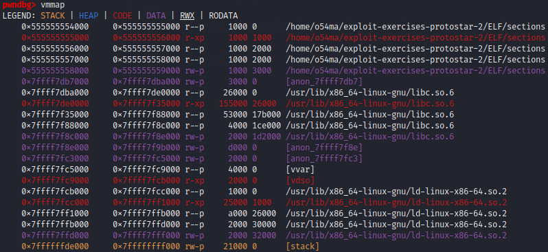
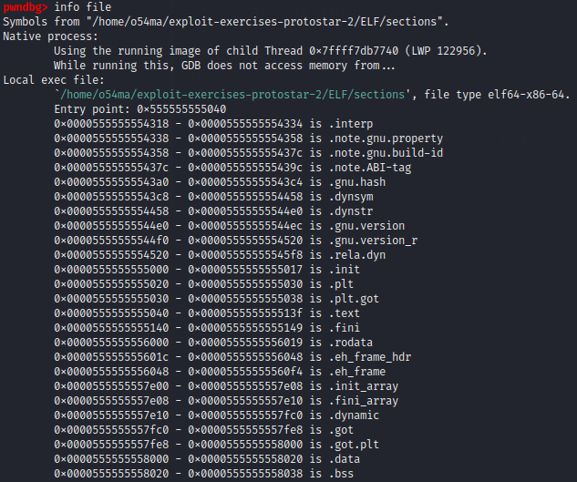
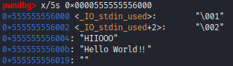
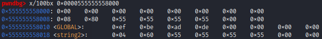
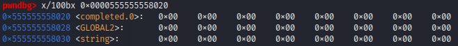

# ELF Anatomy

ELF is short for Executable and Linkable Format. It's a format used for storing `binaries`, `libraries`, and `core dumps` on disks in Linux and Unix-based systems.

The ELF specification used on Linux for the kernel itself and Linux kernel modules.


## ELF Structure

The ELF file is divided into two parts. 

### 1. ELF header (metadata about the file)

```bash
$ readelf --help
#   -a --all               Equivalent to: -h -l -S -s -r -d -V -A -I
#   -h --file-header       Display the ELF file header
#   -l --program-headers   Display the program headers
#      --segments          An alias for --program-headers
#   -S --section-headers   Display the sections' header
#      --sections          An alias for --section-headers
#   -g --section-groups    Display the section groups
#   -t --section-details   Display the section details
#   -e --headers           Equivalent to: -h -l -S
#   -s --syms              Display the symbol table
#      --symbols           An alias for --syms
#      --dyn-syms          Display the dynamic symbol table
#      --lto-syms          Display LTO symbol tables
#      --sym-base=[0|8|10|16]

```

```bash
$ readelf -h /bin/ls

# ELF Header:
#   Magic:   7f 45 4c 46 02 01 01 00 00 00 00 00 00 00 00 00                                <--- file signature
#   Class:                             ELF64                                                <--- architecture (32-bit, 64-bit)
#   Data:                              2's complement, little endian                        <--- data encoding
#   Version:                           1 (current)                                          
#   OS/ABI:                            UNIX - System V                                      <--- ABI (Application Binary Interface)
#   ABI Version:                       0
#   Type:                              DYN (Position-Independent Executable file)           <--- Executable / Shared Obj / Core File
#   Machine:                           Advanced Micro Devices X86-64                        <--- architecture needed for the file.
#   Version:                           0x1
#   Entry point address:               0x6180                                               <--- EP 
#   Start of program headers:          64 (bytes into file)
#   Start of section headers:          145256 (bytes into file)
#   Flags:                             0x0
#   Size of this header:               64 (bytes)                                           <--- See Hexdump below
#   Size of program headers:           56 (bytes)
#   Number of program headers:         11
#   Size of section headers:           64 (bytes)
#   Number of section headers:         30
#   Section header string table index: 29

```

The full ELF header and its values

```bash
$ hexdump -C -n 64 /bin/ls

00000000  7f 45 4c 46 02 01 01 00  00 00 00 00 00 00 00 00  |.ELF............|
00000010  03 00 3e 00 01 00 00 00  80 61 00 00 00 00 00 00  |..>......a......|
00000020  40 00 00 00 00 00 00 00  68 37 02 00 00 00 00 00  |@.......h7......|
00000030  00 00 00 00 40 00 38 00  0b 00 40 00 1e 00 1d 00  |....@.8...@.....|
```

`0x3e` ==> `62` --> AMDs x86-64 architecture  

to view all machine types : 
[elf.h](http://www.opensource.apple.com/source/dtrace/dtrace-90/sys/elf.h)

```bash
$ dumpelf /bin/ls

# include <elf.h>
# ...
# ...
# ... alot of stuff here ^^
```


### 2. File data


#### 2.1 Program headers Table (Segments)

`Program headers table` --> stores information about `segments` --> Each segment is made up of one or more `sections`. 

The kernel uses this information at run time, It tells the kernel how to create the process and map the segments into memory.

> To run a program

* the kernel loads the ELF header and the program header table into memory.
* loads the contents that are specified in LOAD in the program header table into memory.
* the control is given to the executable itself or the interpreter if it’s available


```bash
$ readelf -l /bin/ls

# Program Headers / Segments :
#   Type           Offset             VirtAddr           PhysAddr           FileSiz            MemSiz              Flags  Align
#   PHDR           0x0000000000000040 0x0000000000000040 0x0000000000000040 0x0000000000000268 0x0000000000000268  R      0x8
#   INTERP         0x00000000000002a8 0x00000000000002a8 0x00000000000002a8 0x000000000000001c 0x000000000000001c  R      0x1
#       [Requesting program interpreter: /lib64/ld-linux-x86-64.so.2]

#   LOAD           0x0000000000000000 0x0000000000000000 0x0000000000000000 0x0000000000003538 0x0000000000003538  R      0x1000
#   LOAD           0x0000000000004000 0x0000000000004000 0x0000000000004000 0x00000000000143c9 0x00000000000143c9  R E    0x1000
#   LOAD           0x0000000000019000 0x0000000000019000 0x0000000000019000 0x0000000000008ab8 0x0000000000008ab8  R      0x1000
#   LOAD           0x0000000000022350 0x0000000000023350 0x0000000000023350 0x0000000000001278 0x0000000000002568  RW     0x1000
#   DYNAMIC        0x0000000000022dd8 0x0000000000023dd8 0x0000000000023dd8 0x00000000000001f0 0x00000000000001f0  RW     0x8
#   NOTE           0x00000000000002c4 0x00000000000002c4 0x00000000000002c4 0x0000000000000044 0x0000000000000044  R      0x4
#   GNU_EH_FRAME   0x000000000001df0c 0x000000000001df0c 0x000000000001df0c 0x0000000000000944 0x0000000000000944  R      0x4
#   GNU_STACK      0x0000000000000000 0x0000000000000000 0x0000000000000000 0x0000000000000000 0x0000000000000000  RW     0x10
#   GNU_RELRO      0x0000000000022350 0x0000000000023350 0x0000000000023350 0x0000000000000cb0 0x0000000000000cb0  R      0x1
```

```note
Program headers are essential when `running the executable` because they tell the operating system all it needs to know to put the executable into memory and run it.
```

<br>
<br>

#### 2.2 Section headers Table (Sections)

`Section headers Table` --> stores information about `sections` --> used during `dynamic link time`, just before the program is executed.

```note
A linker links the binary file with shared libraries that it needs by loading them into memory. The linker’s implementation is specific to the operating system.
```

```bash
$ readelf -S /bin/ls

# Section Headers / Sections :
#   [Nr] Name              Type             Address           Offset   Size              EntSize           Flags   Link  Info  Align
#   [ 0]                   NULL             0000000000000000  00000000 0000000000000000  0000000000000000           0     0     0
#   [ 1] .interp           PROGBITS         00000000000002a8  000002a8 000000000000001c  0000000000000000   A       0     0     1
#   [ 2] .note.gnu.bu[...] NOTE             00000000000002c4  000002c4 0000000000000024  0000000000000000   A       0     0     4
#   [ 3] .note.ABI-tag     NOTE             00000000000002e8  000002e8 0000000000000020  0000000000000000   A       0     0     4
#   [ 4] .gnu.hash         GNU_HASH         0000000000000308  00000308 00000000000000ac  0000000000000000   A       5     0     8
#   [ 5] .dynsym           DYNSYM           00000000000003b8  000003b8 0000000000000c00  0000000000000018   A       6     1     8
#   [ 6] .dynstr           STRTAB           0000000000000fb8  00000fb8 00000000000005c5  0000000000000000   A       0     0     1
#   [ 7] .gnu.version      VERSYM           000000000000157e  0000157e 0000000000000100  0000000000000002   A       5     0     2
#   [ 8] .gnu.version_r    VERNEED          0000000000001680  00001680 00000000000000a0  0000000000000000   A       6     2     8
#   [ 9] .rela.dyn         RELA             0000000000001720  00001720 0000000000001440  0000000000000018   A       5     0     8
#   [10] .rela.plt         RELA             0000000000002b60  00002b60 00000000000009d8  0000000000000018  AI       5    24     8
#   [11] .init             PROGBITS         0000000000004000  00004000 0000000000000017  0000000000000000  AX       0     0     4
#   [12] .plt              PROGBITS         0000000000004020  00004020 00000000000006a0  0000000000000010  AX       0     0     16
#   [13] .plt.got          PROGBITS         00000000000046c0  000046c0 0000000000000018  0000000000000008  AX       0     0     8
#   [14] .text             PROGBITS         00000000000046e0  000046e0 0000000000013cde  0000000000000000  AX       0     0     16
#   [15] .fini             PROGBITS         00000000000183c0  000183c0 0000000000000009  0000000000000000  AX       0     0     4
#   [16] .rodata           PROGBITS         0000000000019000  00019000 0000000000004f09  0000000000000000   A       0     0     32
#   [17] .eh_frame_hdr     PROGBITS         000000000001df0c  0001df0c 0000000000000944  0000000000000000   A       0     0     4
#   [18] .eh_frame         PROGBITS         000000000001e850  0001e850 0000000000003268  0000000000000000   A       0     0     8
#   [19] .init_array       INIT_ARRAY       0000000000023350  00022350 0000000000000008  0000000000000008  WA       0     0     8
#   [20] .fini_array       FINI_ARRAY       0000000000023358  00022358 0000000000000008  0000000000000008  WA       0     0     8
#   [21] .data.rel.ro      PROGBITS         0000000000023360  00022360 0000000000000a78  0000000000000000  WA       0     0     32
#   [22] .dynamic          DYNAMIC          0000000000023dd8  00022dd8 00000000000001f0  0000000000000010  WA       6     0     8
#   [23] .got              PROGBITS         0000000000023fc8  00022fc8 0000000000000038  0000000000000008  WA       0     0     8
#   [24] .got.plt          PROGBITS         0000000000024000  00023000 0000000000000360  0000000000000008  WA       0     0     8
#   [25] .data             PROGBITS         0000000000024360  00023360 0000000000000268  0000000000000000  WA       0     0     32
#   [26] .bss              NOBITS           00000000000245e0  000235c8 00000000000012d8  0000000000000000  WA       0     0     32
#   [27] .gnu_debugaltlink PROGBITS         0000000000000000  000235c8 0000000000000049  0000000000000000           0     0     1
#   [28] .gnu_debuglink    PROGBITS         0000000000000000  00023614 0000000000000034  0000000000000000           0     0     4
#   [29] .shstrtab         STRTAB           0000000000000000  00023648 000000000000011c  0000000000000000           0     0     1
```

W (write), A (alloc), X (execute), I (info)

Section names with a dot prefix are reserved for the system

`.note`
Section contains note information.

`.text`
Section contains executable text/instructions/functions. (AX)

global variables and the rodata section that usually contains constant strings.

`.bss`
Section contains uninitialized *read-write* data/global varaibles. (WA)

`.data` 
Section contains initialized *read-write* data/global varaibles. (WA)

`.rodata` 
Section contains initialized *read-only* data (A)

these sections (`.data` & `.rodata`) contain the actual, initialized data, which the program will need in memory.
The memory reserves more space for the data segment than specified in the ELF file to make room for *uninitialized variables*.


<br>

---

> Ex

```c
// sections.c
// gcc sections.c -o sections
#include<stdio.h>

int GLOBAL = 0xdeadbeef;			// Initialized     	--> .data

int GLOBAL2;						// UnInitialized   	--> .bss

char* string;						// UnInitialized   	--> .bss

char* string2 = "HIIOOO";			// Constant String 	--> .rodata
                                    // string2       	--> .data
int main(){

	char *string3 = "Hello World!!";	// Constant String 	--> .rodata
                                        // string3          --> stack  
	return 0;
}
```

```bash
pwndbg> b *main
# Breakpoint 1 at 0x1129

pwndbg> r
# Starting program: /home/o54ma/exploit-exercises-protostar-2/ELF/sections
# [Thread debugging using libthread_db enabled]
# Using host libthread_db library "/lib/x86_64-linux-gnu/libthread_db.so.1"

# Breakpoint 1, 0x0000555555555129 in main ()

pwndbg> vmmap

pwndbg> info file
```



<!--  -->
```c
pwndbg> info files
Symbols from "/home/o54ma/exploit-exercises-protostar-2/ELF/sections".
Native process:
        Using the running image of child Thread 0x7ffff7db7740 (LWP 34936).
        While running this, GDB does not access memory from...
Local exec file:
        `/home/o54ma/exploit-exercises-protostar-2/ELF/sections', file type elf64-x86-64.                               
        Entry point: 0x555555555040
        0x0000555555554318 - 0x0000555555554334 is .interp
        0x0000555555554338 - 0x0000555555554358 is .note.gnu.property
        0x0000555555554358 - 0x000055555555437c is .note.gnu.build-id
        0x000055555555437c - 0x000055555555439c is .note.ABI-tag
        0x00005555555543a0 - 0x00005555555543c4 is .gnu.hash
        0x00005555555543c8 - 0x0000555555554458 is .dynsym
        0x0000555555554458 - 0x00005555555544e0 is .dynstr
        0x00005555555544e0 - 0x00005555555544ec is .gnu.version
        0x00005555555544f0 - 0x0000555555554520 is .gnu.version_r
        0x0000555555554520 - 0x00005555555545f8 is .rela.dyn
        0x0000555555555000 - 0x0000555555555017 is .init
        0x0000555555555020 - 0x0000555555555030 is .plt
        0x0000555555555030 - 0x0000555555555038 is .plt.got 
        0x0000555555555040 - 0x000055555555513f is .text
        0x0000555555555140 - 0x0000555555555149 is .fini
        0x0000555555556000 - 0x0000555555556019 is .rodata
        0x000055555555601c - 0x0000555555556048 is .eh_frame_hdr
        0x0000555555556048 - 0x00005555555560f4 is .eh_frame
        0x0000555555557e00 - 0x0000555555557e08 is .init_array
        0x0000555555557e08 - 0x0000555555557e10 is .fini_array
        0x0000555555557e10 - 0x0000555555557fc0 is .dynamic 
        0x0000555555557fc0 - 0x0000555555557fe8 is .got
        0x0000555555557fe8 - 0x0000555555558000 is .got.plt 
        0x0000555555558000 - 0x0000555555558020 is .data
        0x0000555555558020 - 0x0000555555558038 is .bss
```

`.rodata`

<!--  -->
```c
pwndbg> x/5s 0x0000555555556000
0x555555556000 <_IO_stdin_used>:        "\001"
0x555555556002 <_IO_stdin_used+2>:      "\002"
0x555555556004: "HIIOOO"
0x55555555600b: "Hello World!!"
0x555555556019: ""
```

`.data`

<!--  -->
```c
pwndbg> x/100xb 0x0000555555558000
0x555555558000: 0x00    0x00    0x00    0x00    0x00    0x00    0x00    0x00
0x555555558008: 0x08    0x80    0x55    0x55    0x55    0x55    0x00    0x00
0x555555558010 <GLOBAL>:        0xef    0xbe    0xad    0xde    0x00    0x00    0x00    0x00
0x555555558018 <string2>:       0x04    0x60    0x55    0x55    0x55    0x55    0x00    0x00
```

string2 pointing at 0x555555556004 in .rodata 

`.bss`

<!--  -->

```c
pwndbg> x/100x 0x0000555555558020
0x555555558020 <completed.0>:   0x00    0x00    0x00    0x00    0x00    0x00    0x00    0x00
0x555555558028 <GLOBAL2>:       0x00    0x00    0x00    0x00    0x00    0x00    0x00    0x00
0x555555558030 <string>:        0x00    0x00    0x00    0x00    0x00    0x00    0x00    0x00
```


<br>

---

> Static versus Dynamic binaries

`static binaries` include all the libraries needed to run the program, while `dynamic binaries` use shared libraries that are loaded at runtime. The choice between static and dynamic linking depends on factors such as portability, size of the resulting binary, and ease of updating the libraries.

```bash
$ file /bin/ls  
# /bin/ls: ELF 64-bit LSB pie executable, x86-64, version 1 (SYSV), dynamically linked, interpreter /lib64/ld-linux-x86-64.so.2, BuildID[sha1]=6e3da6f0bc36b6398b8651bbc2e08831a21a90da, for GNU/Linux 3.2.0, stripped


$ $ gcc -o myprogram myprogram.c            # compiled dynamically by default

$ gcc -static -o myprogram myprogram.c      # compiled statically 
```

<br>

---

> PLT and GOT - the key to code sharing and dynamic libraries

`PLT` (Procedure Linkage Table) 

`GOT` (Global Offset Table)

`relocations` are entries in binaries that are left to be filled in later --> at *link time* by the `toolchain linker` or *at runtime* by the `dynamic linker`

In Linux, dynamic linking is performed by a `dynamic linker` program, which is responsible for locating and loading the shared libraries into memory. When an executable program is loaded, the dynamic linker reads a *special section* in the executable file called the dynamic section, which contains information about the shared libraries that the program depends on.

such as : 

`.dynamic`: This section contains information about the dynamic linker, such as its name and version, and the libraries that the program depends on.

`.got`: This section contains the global offset table, which is used by the dynamic linker to *resolve symbols at runtime*.

`.plt`: This section contains the procedure linkage table, which is used by the dynamic linker to *jump to shared library functions*.

`.rel.dyn`: This section contains relocation information for symbols that are defined in shared libraries.

`.rel.plt`: This section contains relocation information for symbols that are used by the program but defined in shared libraries.


The dynamic linker then searches for the required shared libraries and loads them into memory. Once loaded, the shared libraries can be used by the program. If a shared library is not found, the dynamic linker will report an error and the program will not be executed.

```note
 the `.got` and `.plt` sections are the standard data structures used in dynamic linking. The `.got.plt` and `.plt.got` sections are variants that are used in some systems to optimize dynamic linking. The difference between them is in the way they combine entries from the GOT and PLT to optimize the dynamic linking process.
```


```bash
#                                ┌──────┐
#                                │ puts │
#                                └─▲──▲─┘
#                                  │  │
#           the rest of the time   │  │
#      ────────────────────────────┘  │
#                                     │
# ┌──────────┐   .plt      ┌──────────┴────────┐   .plt      ┌─────────────────────────────────┐
# │ puts@plt ├────────────►│jmp [puts@got.plt] ├────────────►│jmp  <_dl_runtime_resolve_xsave> │
# └──────────┘             └──────────▲────────┘             └────────────────┬────────────────┘
#                                     │                                       │
#                                     │                                       │
#                                     │                                       │
#                                     │         just the first time           │
#                                     └───────────────────────────────────────┘
#                                              the got table updated
```


<br>

> Ex

```c
#include<stdio.h>

int main(){
	puts("Hello World!!");
	puts("Bye!!");

	return 0;
}
```


```c
pwndbg> b *main
pwndbg> r
pwndbg> disass main
Dump of assembler code for function main:
=> 0x0000555555555139 <+0>:     push   rbp
   0x000055555555513a <+1>:     mov    rbp,rsp
   0x000055555555513d <+4>:     lea    rax,[rip+0xec0]        # 0x555555556004
   0x0000555555555144 <+11>:    mov    rdi,rax
   0x0000555555555147 <+14>:    call   0x555555555030 <puts@plt>
   0x000055555555514c <+19>:    lea    rax,[rip+0xebf]        # 0x555555556012
   0x0000555555555153 <+26>:    mov    rdi,rax
   0x0000555555555156 <+29>:    call   0x555555555030 <puts@plt>
   0x000055555555515b <+34>:    mov    eax,0x0
   0x0000555555555160 <+39>:    pop    rbp
   0x0000555555555161 <+40>:    ret    
End of assembler dump.

//---------------------------------------------------------------------------------

pwndbg> info files 
        Entry point: 0x555555555050
        0x0000555555554318 - 0x0000555555554334 is .interp
        ...
        ...
        0x0000555555555020 - 0x0000555555555040 is .plt
        0x0000555555555040 - 0x0000555555555048 is .plt.got
        0x0000555555555050 - 0x0000555555555162 is .text
        0x0000555555555164 - 0x000055555555516d is .fini
        0x0000555555556000 - 0x0000555555556018 is .rodata
        ....
        ....
        0x0000555555557fc0 - 0x0000555555557fe8 is .got
        0x0000555555557fe8 - 0x0000555555558008 is .got.plt
        0x0000555555558008 - 0x0000555555558018 is .data
        0x0000555555558018 - 0x0000555555558020 is .bss
```

```c
pwndbg> ni 4

   0x555555555139 <main>       push   rbp
   0x55555555513a <main+1>     mov    rbp, rsp
   0x55555555513d <main+4>     lea    rax, [rip + 0xec0]
   0x555555555144 <main+11>    mov    rdi, rax
 ► 0x555555555147 <main+14>    call   puts@plt <puts@plt>   // Next instruction to be executed !!
        s: 0x555555556004 ◂— 'Hello World!!'

//---------------------------------------------------------------------------------
pwndbg> si

 ► 0x555555555030 <puts@plt>                         jmp    qword ptr [rip + 0x2fca]      <puts@got[plt]>
    
   0x555555555036 <puts@plt+6>                       push   0
   0x55555555503b <puts@plt+11>                      jmp    0x555555555020                <0x555555555020>
    ↓
   0x555555555020                                    push   qword ptr [rip + 0x2fca]      <_GLOBAL_OFFSET_TABLE_+8>
   0x555555555026                                    jmp    qword ptr [rip + 0x2fcc]      <_dl_runtime_resolve_xsave>
    ↓
   0x7ffff7fdd150 <_dl_runtime_resolve_xsave>        push   rbx


// rip + 0x2fca ===> puts@got.plt  ===>  puts@plt+6  (in the first time) 
// keep stepping into, and you will end up calling the linker !! 

// now the seccond puts call in main 

   0x555555555139 <main>       push   rbp
   0x55555555513a <main+1>     mov    rbp, rsp
   0x55555555513d <main+4>     lea    rax, [rip + 0xec0]
   0x555555555144 <main+11>    mov    rdi, rax
   0x555555555147 <main+14>    call   puts@plt                <puts@plt>

   0x55555555514c <main+19>    lea    rax, [rip + 0xebf]    
   0x555555555153 <main+26>    mov    rdi, rax
 ► 0x555555555156 <main+29>    call   puts@plt                <puts@plt>
 
   0x55555555515b <main+34>    mov    eax, 0
   0x555555555160 <main+39>    pop    rbp
   0x555555555161 <main+40>    ret

//---------------------------------------------------------------------------------

pwndbg> si

 ► 0x555555555030 <puts@plt>    jmp    qword ptr [rip + 0x2fca]      <puts>
    ↓
   0x7ffff7e31820 <puts>        push   r14
   0x7ffff7e31822 <puts+2>      push   r13
   0x7ffff7e31824 <puts+4>      push   r12
   0x7ffff7e31826 <puts+6>      mov    r12, rdi

// rip + 0x2fca ===>  puts@got.plt  ===>  puts
```


### 2.3 Data  


## Static analysis 

### Find glibc version
The GNU C Library project provides the core libraries for the GNU system and GNU/Linux systems, as well as many other systems that use Linux as the kernel.

So if you managed to know the ubuntu version the binary is running on. you could find the libc versoin that the binary uses, which could help in revealing some exploits

[glibc/versions](https://repology.org/project/glibc/versions)

```tip
some ctf challenges provide a Dockerfile, which could tell the version of ubuntu used. 
```


```bash
# if you were givin the shared libc file that the binary use. you can find it's version like this. 
$ strings ./libc.so.6 | grep ubuntu
GNU C Library (Ubuntu GLIBC 2.27-3ubuntu1.2) stable release version 2.27.
<https://bugs.launchpad.net/ubuntu/+source/glibc/+bugs>.
```

```bash
# To find glibc version on your system
$ ldd --version
```


---


### $(file) Command
```bash
$ gcc Test.c -o binary
$ file binary 
binary: ELF '64-bit LSB' shared object, x86-64, version 1 (SYSV), 'dynamically linked', interpreter /lib64/ld-linux-x86-64.so.2, BuildID[sha1]=168aeeeaf02232025c069bf069d9304b9337a959, for GNU/Linux 3.2.0, 'not stripped'

$ gcc Test.c -o binary -s
$ file binary 
binary: ELF '64-bit LSB' shared object, x86-64, version 1 (SYSV), 'dynamically linked', interpreter /lib64/ld-linux-x86-64.so.2, BuildID[sha1]=8df0b7e976362d9615d1ae74f92b856b9e7cc843, for GNU/Linux 3.2.0, 'stripped'

$ gcc Test.c -o binary -s -static
$ file binary 
binary: ELF '64-bit LSB' executable, x86-64, version 1 (SYSV), 'statically linked', BuildID[sha1]=1dfba00f274e9fef1e65dc0a1a9fb50382960116, for GNU/Linux 3.2.0, 'stripped'

#--------------------------------------------------------

$ file libc.so.6     
libc.so.6: ELF 64-bit LSB `shared object`, x86-64, version 1 (GNU/Linux), `dynamically linked`, interpreter /lib64/ld-linux-x86-64.so.2, BuildID[sha1]=d3cf764b2f97ac3efe366ddd07ad902fb6928fd7, for GNU/Linux 3.2.0, stripped


```


---


### stripped OR not stripped


  
#### How to find the main function address on gdb ?? (ASLR/PIE enabled)

```c
pwndbg> r
[Inferior 1 (process 13270) exited normally]

pwndbg> b __libc_start_main

pwndbg> r 

Breakpoint 1, __libc_start_main_impl(main=0x555555400920, argc=1, argv=0x7fffffffdef8, init=0x555555400ba0, fini=0x555555400c10, rtld_fini=0x7ffff7fceaa0 <_dl_fini>,stack_end=0x7fffffffdee8) at ../csu/libc-start.c:340

// main=0x555555400920     is the addr of the main ^^

```


---


### Patch the binary !! 

patching ELF binaries to use specific versions of glibc with `pwninit` :

```bash
$ tree 
.
└── Folder
    ├── binary
    └── libc.so.6

$ cd Folder
$ pwninit

$ tree 
.
└── Folder
    ├── binary
    ├── binary_patched
    ├── ld-2.27.so
    └── libc.so.6
```
what pwninit did ?? 

* Downloaded a linker (ld-linux.so.*) that can segfaultlessly load the provided libc
* Downloaded debug symbols and unstrip the libc
* Patched the binary with patchelf to use the correct RPATH and interpreter for the provided libc


```bash
# after pwninit, you can run patchelf on the non-patched binary to patch it ^^ 
$ patchelf  --set-interpreter ./ld-2.27.so ./binary
```


---


### CheckSec 
```bash
$ checksec binary
[*] '/tmp/a.out'
    Arch:     amd64-64-little
    RELRO:    Partial RELRO
    Stack:    No canary found
    NX:       NX enabled
    PIE:      PIE enabled
```

#### FULL RELRO vs. Partial RELRO


RELRO is a generic exploit `mitigation technique` to harden the `data sections` of an ELF binary or process.

From an attackers point-of-view, `partial RELRO` makes almost no difference, other than it forces the `GOT` to come before the `BSS` in memory,

eliminating the risk of a `buffer overflows` on a global variable overwriting `GOT`.

---

`Full RELRO` makes the entire GOT `read-only` which removes the ability to perform a "GOT overwrite" attack


```c
// main.c
#include<stdio.h>
int main(){

    printf("Hello World\n");

return 0;
}
```

```bash
$ gcc main.c        # Partial RELRO 
$ r2 a.out

    [0x00001050]> iS
    [Sections]

    nth paddr        size vaddr       vsize perm name
    ―――――――――――――――――――――――――――――――――――――――――――――――――
    0   0x00000000    0x0 0x00000000    0x0 ---- 
    1   0x00000318   0x1c 0x00000318   0x1c -r-- .interp
    2   0x00000338   0x20 0x00000338   0x20 -r-- .note.gnu.property
    3   0x00000358   0x24 0x00000358   0x24 -r-- .note.gnu.build-id
    4   0x0000037c   0x20 0x0000037c   0x20 -r-- .note.ABI-tag
    5   0x000003a0   0x24 0x000003a0   0x24 -r-- .gnu.hash
    6   0x000003c8   0xa8 0x000003c8   0xa8 -r-- .dynsym
    7   0x00000470   0x8d 0x00000470   0x8d -r-- .dynstr
    8   0x000004fe    0xe 0x000004fe    0xe -r-- .gnu.version
    9   0x00000510   0x30 0x00000510   0x30 -r-- .gnu.version_r
    10  0x00000540   0xc0 0x00000540   0xc0 -r-- .rela.dyn
    11  0x00000600   0x18 0x00000600   0x18 -r-- .rela.plt
    12  0x00001000   0x17 0x00001000   0x17 -r-x .init
    13  0x00001020   0x20 0x00001020   0x20 -r-x .plt                   # .plt
    14  0x00001040    0x8 0x00001040    0x8 -r-x .plt.got               # .plt.got
    15  0x00001050  0x103 0x00001050  0x103 -r-x .text                  # .text
    16  0x00001154    0x9 0x00001154    0x9 -r-x .fini
    17  0x00002000   0x10 0x00002000   0x10 -r-- .rodata
    18  0x00002010   0x2c 0x00002010   0x2c -r-- .eh_frame_hdr
    19  0x00002040   0xac 0x00002040   0xac -r-- .eh_frame
    20  0x00002dd0    0x8 0x00003dd0    0x8 -rw- .init_array
    21  0x00002dd8    0x8 0x00003dd8    0x8 -rw- .fini_array
    22  0x00002de0  0x1e0 0x00003de0  0x1e0 -rw- .dynamic
    23  0x00002fc0   0x28 0x00003fc0   0x28 -rw- .got                   # .got          it's writable
    24  0x00002fe8   0x20 0x00003fe8   0x20 -rw- .got.plt               # .got.plt      it's writable
    25  0x00003008   0x10 0x00004008   0x10 -rw- .data                  # .data         it's writable
    26  0x00003018    0x0 0x00004018    0x8 -rw- .bss                   # .bss          it's writable
    27  0x00003018   0x1e 0x00000000   0x1e ---- .comment
    28  0x00003038  0x360 0x00000000  0x360 ---- .symtab
    29  0x00003398  0x1da 0x00000000  0x1da ---- .strtab
    30  0x00003572  0x11a 0x00000000  0x11a ---- .shstrtab
```


---


#### PIE vs. ASLR 

`Address Space Layout Randomisation` (ASLR), every time you run a binary, libc (and other libraries) get `loaded` into a different memory address.

simply it randomizes everything in the proccess except hte code section

`Position Independent Executable` (PIE), randomizes the code section only, like main address and other functions addresses.

```note
The main difference is that PIE can be compiled into the binary while the presence of ASLR is completely dependant on the environment running the binary.


But anyway, ASLR is enabled by PIE, but PIE is a thing even with ASLR disabled. :triumph:
```

> to Disable ASLR on your system : (Do it everytime the system restarted)
```bash
$ sudo bash -c "echo 0 > /proc/sys/kernel/randomize_va_space"

$ # sudo bash -c "echo 2 > /proc/sys/fs/suid_dumpable"              ?? 
```


---


#### NX / DEP 

`Data Execution Prevention` (DEP) or `No-Execute` (NX), 
When this option is enabled, it works with the processor to help prevent buffer overflow attacks by `blocking code execution` from memory that is marked as non-executable.


#### Stack Canaries

One way to prevent the stack-based buffer overflow, it's a secret value placed on the stack which `changes every time` the program is started. `Prior` to a function return,

the stack canary is checked and if it appears to be modified, the program exits immeadiately.


#### GOT & PLT

`Global Offset Table` (GOT)


### Ghidra 


## References
* https://www.baeldung.com/linux/executable-and-linkable-format-file
* https://linux-audit.com/elf-binaries-on-linux-understanding-and-analysis/
* https://www.technovelty.org/linux/plt-and-got-the-key-to-code-sharing-and-dynamic-libraries.html