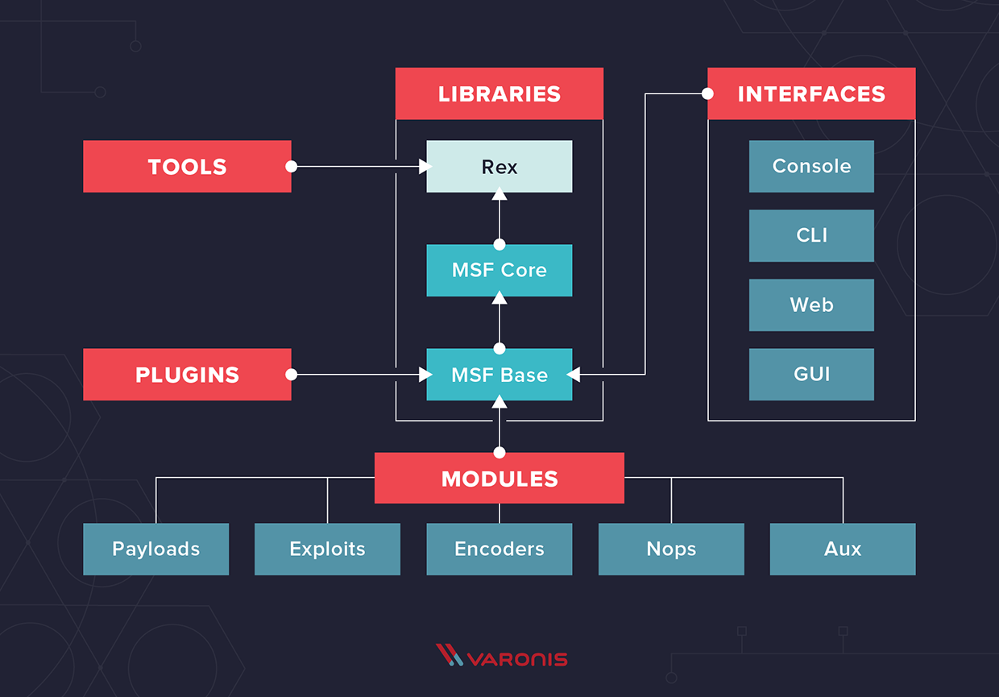

---
sort : 2 
--- 

# Metasploit Framework (MSF)

Metasploit is primarily designed as an exploitation toolkit. It contains a variety of different modules that have prepackaged exploits for a number of vulnerabilities.

> Installation

```bash
$ sudo apt update
$ sudo apt install metasploit-framework

# 1 upgraded, 0 newly installed, 0 to remove and 1183 not upgraded. ^^ 
```

> initialize the database! (PostgreSQL) !! 

```bash
$ msfdb init

$ msfconsole -q

# to check that we've connected to the database
msf6 > db_status

# to save the settings/active datastores in metasploit 
msf6 > save 
```

> MetaSploit Framework architecture 

<p align="center"> 
   
</p>


| exploit | module holds all of the exploit code                                                                                                            |   |
|---------|-------------------------------------------------------------------------------------------------------------------------------------------------|---|
| payload | Used hand in hand with exploits, contains the various bits of `shellcode` we send to have executed following exploitation                         |   |
| aux     | commonly used in `scanning and verification` machines are exploitable, This is not the same as the actual exploitation of course                  |   |
| post    | One of the most common activities after exploitation is `looting and pivoting`. Which module provides these capabilities                          |   |
| encoder | Commonly utilized in `payload obfuscation`, module allows us to modify the 'appearance' of our exploit such that we may avoid signature detection |   |
| nop     | used with `buffer overflow` and `ROP` attacks                                                                                                       |   |
| load    | a command to load different modules                                                                                                             |   |


<br><br>


# Searchsploit

```bash
$ searchsploit -u                         # updating !! 
# OR some of the exploit metadata are not included. To access them,
$ searchsploit [exploitName Version] -w   # Exploit-DB Online

$ searchsploit  -m  exploit-db-number.rb  # mirror/copy the exploit 


# Examples :

$ searchsploit afd windows local
$ searchsploit -t oracle windows
$ searchsploit -p 39446
$ searchsploit linux kernel 3.2 --exclude="(PoC)|/dos/"
$ searchsploit -s Apache Struts 2.0.0
$ searchsploit linux reverse password
$ searchsploit -j 55555 | json_pp
```


<!-- >ues multi/handler
> set PAYLOAD windows/meterpreter/reverse_tcp
>show options


run the exploit now via either the command 'exploit' or the command 'run -j' to run this as a job.
Once we've started this, we can check all of the jobs running on the system by running the command `jobs`


meterpreter > 
What command do we use to transfer ourselves into the process? This won't work at the current time as we don't have sufficient privileges but we can still try!  :::: migrate

What command can we run to find out more information regarding the current user running the process we are in? :: getuid

finding more information out about the system itself?:::: sysinfo

meterpreter > load kiwi

figure out the privileges of our current user::: getprivs

then transfer files to the victim machine ::: upload
or run a Metasploit module::: run 

figure out the networking information and interfaces on our victim?:: ipconfig / ifconfig  

> run post/windows/gather/checkvm. This will determine if we're in a VM, a very useful piece of knowledge for further pivoting.
> run post/multi/recon/local_exploit_suggester. This will check for various exploits which we can run within our session to elevate our privileges 


Finally, let's try forcing RDP (remote Desktop protocol) to be available. This won't work since we aren't administrators, however, this is a fun command to know about: > run post/windows/manage/enable_rdp

> shell     # to finally spawn a system shell 


in the shell 
let's take a look at the autorouting options available to us in Metasploit

While our victim machine may not have multiple network interfaces (NICs), we'll walk through the motions of pivoting through our victim as if it did have access to extra networks -->