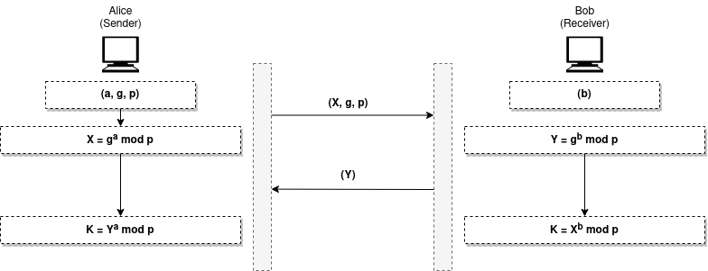
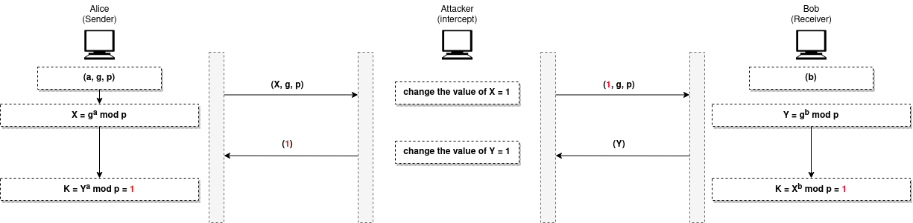

<style>
span {
	markdown: "1";
}

span ~ mjx-container {
  text-align  : left;
}

</style>


<script>
MathJax.Hub.Config({
    jax: ["input/TeX","output/HTML-CSS"],
    displayAlign: "left"
});
</script>

# Modular Arithmetic

## Concepts and Definitions

*Modular arithmetic* : is a system of arithmetic for integers, which considers the remainder. 

*Modulo and Modulus* : It is basically an operator which is denoted by `mod` and in programming uses `%` symbol. 
 
<span> $$ x \mod N, \ \ a \rightarrow dividend, N \rightarrow divisor \ (Modulus \ | \ Moduli)$$ </span>  

*congruence operator* : `≡` is the symbol for congruence, which means the values A and B are in the same equivalence class. i.e. `2 ≡ 12 (mod 10)`  ==> `2 mod 10 = 12 mod 10` 

```
if m | a then a ≡ 0 mod m
```

*identity element / neutral element* : The element of a set of numbers that when combined with another number under a particular binary operation leaves the second number unchanged

<span> $$ a + 0 = a $$ </span> 

<span> $$ a \times 1 = a $$ </span> 

*inverse element* : is another element in the set that, when combined on the right or the left through the binary operation, always gives the identity element as the result.

<span> $$ a + b = 0 \rightarrow 5 + (-5) = 0 $$ </span> 

<span> $$ a \times b = 1 \rightarrow 5 \times ({1 \over 5}) = 1 $$ </span> 


*The integers modulo p define a field, denoted by*

<span> $$ F_{p} = \left\{ 0,1,...,p-1 \right\} $$ </span>  

under both addition and multiplication there is an inverse element `b` for every element `a` in the set, such that `a + b = 0` and `a * b = 1`.

If the modulus is not prime, the set of integers modulo n define a ring.  <span> $$ F_{n} $$ </span>  


<br>

---


## Modular arithmetic properties


* <span> $$ (a+b) \mod n = [(a \mod n) + (b \mod n)] \mod n; $$ </span> 

* <span> $$ (a-b) \mod n = [(a \mod n) - (b \mod n)] \mod n; $$ </span> 

* <span> $$ (a\times b) \mod n = [(a \mod n)\times (b \mod n)] \mod n;$$ </span> 

* <span> $$ 10^a \mod n = (10 \mod n)^a;$$ </span> 


---------------------------------------------
> Properties of addition

* <span> $$ \text{If} \ a + b = c, \ then \ a \ (mod\ N) + b \ (mod\ N) \equiv c \ (mod\ N); $$ </span> 


* <span> $$ \text{If} \ a \equiv b \ (mod\ N), \ then \ a + k \equiv b + k \ (mod\ N); \  \text{for any integer} \ k $$ </span> 

* <span> $$ \text{If} \ a \equiv b \ (mod\ N) \ and \ c \equiv d \ (mod\ N), then \ a + c \equiv b + d \ (mod\ N); $$ </span> 

* <span> $$ \text{If} \ a \equiv b \ (mod\ N), then -a \equiv -b \ (mod\ N); $$ </span> 

---------------------------------------------
> Properties of multiplication

* <span> $$ \text{If} \ a \times b = c, then \ a \ (mod\ N) \times b \ (mod\ N) \equiv c \ (mod\ N); $$ </span> 

<details style="display=flex;"><summary>EX</summary>

<div style="border-style: double; padding: 4px">

<span> $$ \text{What is} \ (8 \times 16) \ (mod\ 7) ? $$ </span> 

<p> since </p>

<span> $$ 8 \equiv 1 \ (mod\ 7) \ \text{and} \ 16 \equiv 2 \ (mod\ 7) $$ </span> 

<p> we have </p>

<span> $$ (8 \times 16) \equiv (1 \times 2) \equiv 2 \ (mod\ 7) $$ </span> 


</div>

</details>


* <span> $$ \text{If} \ a \equiv b \ (mod\ N), then \ ka \equiv kb \ (mod\ N); \  \text{for any integer} \ k $$ </span> 


* <span> $$ \text{If} \ a \equiv b \ (mod\ N), and \ c \equiv d \ (mod\ N)\ , then \ \ ac \equiv bd \ (mod\ N); $$ </span> 


---------------------------------------------
> Properties of Exponentiation

* <span> $$ \text{If} \ a \equiv b \ (mod\ N), then \ a^{k} \equiv b^{k} \ (mod\ N); \  \text{for any positive integer} \ k $$ </span> 


<details style="display=flex;"><summary>EX</summary>

<div style="border-style: double; padding: 4px;">

<span> $$ \text{What is} \ 3 ^{16} \ (mod\ 4) \ ? $$ </span> 

<p>we observe that</p>

<span> $$ 3^{2} \equiv 9 \equiv 1 \ (mod\ 4) $$ </span> 

<p>so</p>

<span> $$ 3^{16} \ (mod\ 4) \equiv (3^{2})^{8} \ (mod\ 4) \equiv (1)^{8} \ (mod\ 4) \equiv 1 \ (mod\ 4) $$ </span> 

</div>

</details>


```note
The last digit of a number is equivalent to the number taken modulo 10.
```


---

## Fermat's Little Theorem 

knwing that <span> $$ p $$ </span>  is a prime number

* <span> $$ a^{p} \equiv a \ (mod \ p) $$ </span> 

* <span> $$ a^{p-1} \equiv 1 \ (mod \ p) $$ </span> 

* <span> $$ a^{-1} \equiv a^{p-2} \ (mod\ p) $$ </span> 


<details style="display=flex;"><summary>HOW ?</summary>

<div style="border-style: double; padding: 4px">

<span> $$ a^{p-1} \equiv 1 \ (mod\ p) $$ </span> 

<br>

<span> $$ a^{p-1} \times a^{-1} \equiv a^{-1} \ (mod\ p) $$ </span> 

<br>

<span> $$ a^{p-2} \times a \times a^{-1} \equiv a^{-1} \ (mod\ p) $$ </span> 

<br>

<span> $$ a^{p-2} \equiv a^{-1} \ (mod\ p) $$ </span> 

<br>

<span> $$ a^{p-2} \mod p = a^{-1} $$ </span> 

</div>

</details>


---

## Euler's Phi-Function | Euler's totient Function 

* <span> $$ \varphi(1) = 0; $$ </span> 

* <span> $$ \varphi(p) = p-1;\ \ \ \ \ \ \ \ \ \ \ \ \ \ \ \ \ \ \ \ \ \ \ p \ is \ prime $$ </span> 

* <span> $$ \varphi(m \times n) = \varphi(m) \times  \varphi(n); \ \ \ \ \ \ m \ and \ n \ are \ coprimes $$ </span> 

* <span> $$ \varphi(p^e) = p^e - p^{e-1};\ \ \ \ \ \ \ \ \ \ \ \ \ \ \ \ \ p \ is \ prime $$ </span> 

<br>


---

## Euler's Theorem 

* <span> $$ a^{\varphi(n)} \equiv 1 \ (mod \ n) $$ </span> 

* <span> $$ a^{k \times \varphi(n) + 1} \equiv a \ (mod \ n) $$ </span> 

* <span> $$ a^{-1} \equiv a^{\varphi(n) - 1} \ (mod\ n) $$ </span> 


---

## Modular Inverse

<span> $$ \text{A modular inverse of an integer} \ b \ (mod\ n) \ \text{is the integer} \ b^{-1} \text{ such that :} $$ </span> 

* <span> $$ b \times b^{-1} \equiv 1 \ (mod\ n) $$ </span> 

<br>

<span> $$ \text{So for any element} \ g \ \text{in the field} \ F_{p} \ (not \ F_{n}) \ \text{there exists a unique integer } d \ \text{in the field such that} $$ </span>   

* <span> $$ g \times d \equiv 1 \ (mod\ p) \ \ \ \ OR \ \ \ \ g \times d \ mod \ p = 1 $$ </span> 


<details style="display=flex;"><summary>EX1</summary>

<div style="border-style: double; padding: 4px">

<span> $$ \text{What is the inverse element:} \ 3 \times d \equiv 1 \ (mod\ 13) \ ? $$ </span> 

<p>From the third Fermat's Little Theorem</p>

<span> $$ d \equiv 3^{-1} \equiv 3^{p-2} \ (mod\ p) $$ </span> 

<br>

<span> $$ 3^{-1} \equiv 3^{13-2} \ (mod\ 13) $$ </span> 

<br>

<span> $$ 3^{-1} \equiv 9 \ (mod\ 13) $$ </span> 

<p>hence</p>

<span> $$ 3 \times 3^{-1} \equiv 1 \ (mod\ 13) $$ </span> 

<br>

<span> $$ 3 \times 9 \equiv 1 \ (mod\ 13) $$ </span> 

<p>finally</p>

<span> $$ d = 9 $$ </span> 

</div>

</details>


<details style="display=flex;"><summary>EX2</summary>

<div style="border-style: double; padding: 4px">

<span> $$ \text{What is the inverse element:} \ 3 \times d \equiv 1 \ (mod\ 10) \ ? $$ </span> 

<p>Notice that n = 10, which is not a prime number </p>
<p>But since g and n are relatively prime, we will apply the third Euler's Theorem</p>

<span> $$ d \equiv 3^{-1} \equiv 3^{\varphi(n)-1} \ (mod\ n) $$ </span> 

<br>

<span> $$ 3^{-1} \equiv 3^{\varphi(10)-1} \ (mod\ 10) $$ </span> 

<br>

<span> $$ 3^{-1} \equiv 3^{3} \ (mod\ 10) \ \ \ \leftarrow \varphi(10) = \varphi(2) \times \varphi(5) = 4 $$ </span> 

<br>

<span> $$ 3^{-1} \equiv 7 \ (mod\ 10) $$ </span> 

<p>hence</p>

<span> $$ 3 \times 3^{-1} \equiv 1 \ (mod\ 10) $$ </span> 

<br>

<span> $$ 3 \times 7 \equiv 1 \ (mod\ 10) $$ </span> 

<p>finally</p>

<span> $$ d = 7 $$ </span> 

</div>

</details>

<br>

```python
from Crypto.Util.number import inverse
inverse(3, 13)

#====================================================
def egcd(a, b):
    if a == 0:
        return b, 0, 1
    else:
        gcd, u, v = egcd(b % a, a)
        return gcd, v - (b // a) * u, u

def modinv(a, n):
    gcd, x, y = egcd(a, n)
    if gcd != 1:
        return None  # modular inverse does not exist
    else:
        return x % n

modinv(3, 13)
```


---

## Quadratic Residue

If q and n are coprime integers, then q is called a quadratic residue modulo n if the following congruence has a solution

* <span> $$ x^{2} \equiv q \ (mod\ n), \ where \ x \in F_{n} $$ </span> 

Likewise, if it has no solution, then it is called a quadratic non-residue modulo n. 

```
So the square root of the Quadratic Residue modulo an integer equal ±x  

And the square root of the None Quadratic Residue modulo an integer does not exist !! 
```

if n is a prime number you will find out that exactly half of the integers between 1 and p−1 are squares mod p, that is, the congruence 

* <span> $$ x^{2} \equiv q \ (mod\ p), \ where \ x \in F_{p} $$ </span> 

has a <span> $$ \frac{p-1}{2} $$ </span>  solutions


<details style="display=flex;"><summary>EX</summary>

<div style="border-style: double; padding: 4px">

<p>Find ALL  quadratic residues mod 5 </p>

<span> $$ 0^{2} \ (mod\ 5)  = 0 \ \leftarrow q $$ </span> 

<br>

<span> $$ 1^{2} \ (mod\ 5)  = 1 $$ </span> 

<br>

<span> $$ 2^{2} \ (mod\ 5)  = 4 $$ </span> 

<br>

<span> $$ 3^{2} \ (mod\ 5)  = 4 $$ </span> 

<br>

<span> $$ 4^{2} \ (mod\ 5)  = 1 $$ </span> 

<p> So the quadratic residues mod 5 are 1,4 and the non-residues are 2,3 </p>

</div>

</details>

<br>


```note
A number that is congruent to 0 mod p is neither a residue nor a non-residue. 
```

> Euler’s criterion

A number `x` is square root of `q` under modulo `p` if 

<span> $$ x^{2} \equiv q \ (mod\ p) $$ </span> 


<br>

>  Properties of quadratic (non-)residues

* <span> $$ \text{Quadratic Residue} \times \text{Quadratic Residue} = Quadratic Residue $$ </span> 

* <span> $$ \text{Quadratic Residue} \times \text{Quadratic Non-Residue = Quadratic Non-Residue} $$ </span> 

* <span> $$ \text{Quadratic Non-Residue} \times \text{Quadratic Non-Residue = Quadratic Residue $$ </span> 

an easy way to remember this : 

<span> $$ \text{Quadratic Residue} \leftarrow 1, \ \ \ \text{Quadratic Non-Residue} \leftarrow 0 $$ </span> 	


<br>

> Legendre symbol

The Legendre Symbol gives an efficient way to determine whether an integer is a quadratic residue modulo an odd prime p


<span> $$ \frac{q}{p} \equiv q^{(\frac{p-1}{2})} \ (mod\ p) $$ </span> 	

Legendre's Symbol obeys:

<span> $$ \left\{\frac{q}{p} = 1\right\} \ \text{if} \ q \ \text{is a quadratic residue and} \ q \not\equiv 0 \ (mod\ p) $$ </span> 	

<span> $$ \left\{\frac{q}{p} = -1\right\} \ \text{if} \ q \ \text{is a quadratic non-residue mod p} $$ </span> 	

<span> $$ \left\{\frac{q}{p} = 0\right\} \ \text{if} \ q \equiv 0 \ (mod\ p) $$ </span> 


Which means given any integer a, calculating `pow(q, (p-1)//2, p)` is enough to determine if q is a quadratic residue.


> Tonelli-Shanks algorithm

is a technique for solving for x in a congruence of the form:

<span> $$ x^{2} \equiv q \ (mod\ p) $$ </span> 

which is also the square root of quadratic residue modulo a prime 

```python
sage: from sage.rings.finite_rings.integer_mod import square_root_mod_prime 

sage: q = ... # the Quadratic Residue
sage: p = ... # the modulus

sage: q = Mod(q, p)

sage: square_root_mod_prime(q, p)
```

```note
Tonelli-Shanks doesn't work for composite (non-prime) moduli,

The main use-case for this algorithm is finding elliptic curve co-ordinates
```


<br>

--- 

## Chinese Remainder Theorem (CRT)

gives a unique solution to a set of linear congruences if their moduli are coprime.


<span> $$ x \equiv a_{1} \mod n_{1} $$ </span> 

<span> $$ x \equiv a_{2} \mod n_{2} $$ </span> 	

<span> $$ . \ . \ . $$ </span> 

<span> $$ x \equiv a_{k} \mod n_{k} $$ </span> 

There is a unique solution :

<span> $$ x \equiv a \mod N, \ where \ N = n_{1} \times n_{2} \times ... \times n_{k} $$ </span> 


<details style="display=flex;"><summary>EX</summary>

<div style="border-style: double; padding: 4px">

<p>Given the following set of linear congruences: </p>

<span> $$ x \equiv 2 \ (mod\ 5) $$ </span> 

<br>

<span> $$ x \equiv 3 \ (mod\ 11) $$ </span> 	

<br>

<span> $$ x \equiv 5 \ (mod\ 17) $$ </span> 

<p> Find the integer a such that </p>

<span> $$ x \equiv a \ (mod\ 935) $$ </span> 

<p> the Solution </p>

<span> $$ \text{1. Find} \ N = n_{1} \times n_{2} \times ... \times n_{k} $$ </span> 

<br>

<span> $$ \text{2. Find} \ N_{1} = \frac{N}{n_{1}} \ , \ N_{2} = \frac{N}{n_{2}} \ , \ ... \ , \ N_{k} = \frac{N}{n_{k}} $$ </span> 

<br>

<span> $$ \text{3. Find the multiplicative inverse of} \ N_{1} \ , \ N_{2} \ , \ ... \ , N_{k} \ \text{using the corresponding moduli} \ n_{1} \ , \ n_{2} \ , \ ... \ , \ n_{k} \ \text{call the inverse} \ N_{1}^{-1} \ , \ N_{2}^{-1} \ , \ ... \ , \ N_{k}^{-1}  $$ </span> 

<br>

<span> $$ \text{4. } \ x = (a_{1} \times N_{1} \times N_{1}^{-1}) + (a_{2} \times N_{2} \times N_{2}^{-1}) + ... + (a_{k} \times N_{k} \times N_{k}^{-1}) $$ </span> 

<br>

<span> $$ x = 872 $$ </span> 

</div>

</details>

<br>

```python3
sage: CRT_list([2,3,5], [5,11,17])
872
```


<br>

--- 

## Diffie-Hellman (DH - Exponential Key Exchange Method)

<span> $$ \text{Every element of a finite field } F_{p} \text{ can be used to make a subgroup } H \text{ under repeated action of multiplication." />

<span> $$ \text{In other words, for an element } g : H = \{g, g^{2}, g^{3}, ...\}" />

> Primitive Elements / Generators  

<span> $$ \text{A primitive element of } F_{p} \text{ is an element whose subgroup } H = F_{p} $$ </span> 

 

<span> $$ \text{which means that every element of } F_{p} \text{ can be written as } \rightarrow \ g^{n} \ mod\ p $$ </span>   <span> $$  , \ n \in \mathbb{Z} $$ </span>  


<span> $$ \text{Because of this, primitive elements are sometimes called generators of the finite field} $$ </span> 

```notes
There could be more than one primitive element for the finite field, and rather than using a set and checking if every element of Fp has been
generated, we can also rapidly disregard a number from being a generator
by checking if the cycle it generates is smaller in size than p.

If we detect a cycle before p elements, g can't be a generator of Fp.
```

```python
def is_generator(g, p):
  for n in range(2, p):
    if pow(g, n, p) == g:
      return False
  return True

p = 28151
for g in range(p):
  if is_generator(g, p):
    print(g)
```

```python
sage: GF(28151).primitive_element()
```

<br>

> DH Protocol/Procedure 

<p align="left"> 
   
</p>


* Establish a prime number `p` and some generator of the finite field `g`

* The user then picks a secret integer `a` (Private Key) , where `a < p` , then calculates

<span> $$ X = g^{a} \ mod\ p $$ </span> 

* The user will send `g`, `p` (Public Key) and `X`, making it so difficult to calculate `a` (by taking the discrete logarithm).

* The receiver then picks a secret integer `b` (Private Key) , where `b < p` , then calculates

<span> $$ Y = g^{b} \ mod\ p $$ </span> 

* Then he will send back `Y` 

* Now both sides can generate their shared keys as follows

<span> $$ K \ = \ X^{b} \ mod\ p \ =  \ Y^{a} \ mod\ p \ = \ g^{a \times b} \ mod\ p $$ </span> 


<br>

> MITA

<p align="left"> 
   
</p>


<br>

> Discrete Log Problem (DLP)

we mentioned that using the primitive element `g`, every element in `Fp` can be written as :

<span> $$ X = g^{n} \ mod\ p $$ </span> 

knowing only the values of `X`, `g`, and `p` leaving as with the problem of finding `n`, and this is known as the discrete log problem.

<span> $$ n = log_{g}(X) \ mod\ p $$ </span> 

The discrete logarithm problem is considered to be computationally intractable. That is, no efficient classical algorithm is known for computing discrete logarithms in general.

<span> $$ \text{all known algorithms run in } O(2^{N^{C}}) \text{ , where } C > 0 $$ </span> 

<br>

<!-- https://cryptohack.gitbook.io/cryptobook/abstract-algebra/groups/untitled -->

```python
from sympy.ntheory import discrete_log

# A = g^a mod p
a = discrete_log(p, A, g)
```

```python
# A = g^a mod p

# using Pohlig-Hellman and baby-step giant-step alogrithms
sage: a = discrete_log(A, Mod(g, p))

# OR using a Pari znlog (linear sieve index calculus method)
sage: int(pari(f"znlog({int(A)},Mod({int(g)},{int(p)}))"))  # a bit faster 

sage: gp.znlog(A, gp.Mod(g, p))
```

```python
# using sagemath
def pohligHellmanPGH(p,A,g):
    #g must be small
    F=IntegerModRing(p)
    g=F(g)
    A=F(A)
    G=[]
    H=[]
    X=[]
    c=[]
    N=factor(p-1)
    for i in range(0,len(N)):
        G.append(g^((p-1)/(N[i][0]^N[i][1])))
        H.append(A^((p-1)/(N[i][0]^N[i][1])))
        X.append(log(H[i],G[i]))
        c.append((X[i],(N[i][0]^N[i][1])))

    print("G=",G,"\n","H=",H,"\n","X=",X)

    #Using Chinese Remainder
    c.reverse()

    for i in range(len(c)):
        if len(c) < 2:
            break
        t1=c.pop()
        t2=c.pop()
        r=crt(t1[0],t2[0],t1[1],t2[1])
        m=t1[1]*t2[1]
        c.append((r,m))

    print("(a,p-1) =",c[0])
 

sage: a = pohligHellmanPGH(p, A, g)
sage: a 
# G= [8213473543459478292, 3854530033786951538, 15842502293236950997, 11361374755113076881, 4654654383183389733] 
#  H= [7794196832818169365, 1, 12912327280035100030, 14801588540420624265, 15860493449920325450] 
#  X= [3, 0, 83, 1881, 73825648379]
# (a,p-1) = (3466191685115160123, 16007670376277647656)
```


---


<br><br>


## References

* https://g.co/kgs/jsEVup
* https://cryptohack.org/


