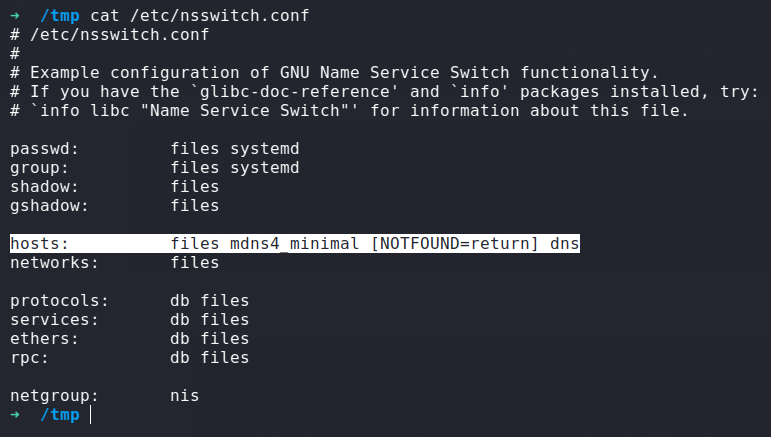
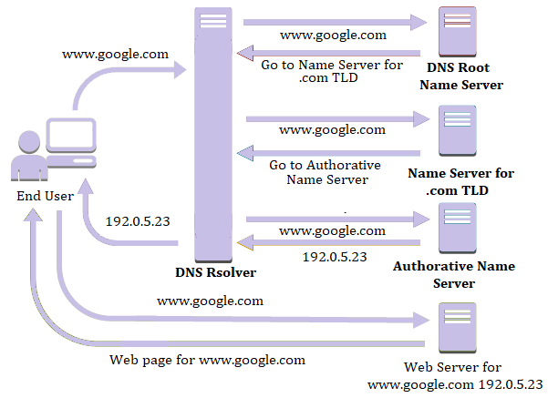

# Virtual Hosting

```note
DNS (Domain Name System or Service) is a hierarchical decentralized naming system/service that translates domain names into IP addresses on the Internet or a private network
```

> Why do we need sometimes to setup a local DNS server using the hosts file "/etc/hosts" for local domain resolution ?
> otherwise the website won't be found 404 

<b>
 The idea is web servers see the host name that the browser is attempting to contact regardless of how the IP was resolved.
 So a single web server can host multiple sites - with a different domain names - on a single IP and thus uses the host name to determine which site/content to respond with.
</b>

```
GET index.php/ HTTP/1.1
Host: www.example.com           <<==
User-Agent: .....
```

With `name-based virtual hosting`, the server relies on the client to report the hostname as part of the HTTP headers. Using this technique, many different hosts can share the same IP address.

For example, suppose that you are serving the domain `www.example.com` and you wish to add the virtual host `other.example.com`, which points at the same IP address. Then you simply add the following to `httpd.conf`:

```xml
<VirtualHost *:80>
    # This first-listed virtual host is also the default for *:80
    ServerName www.example.com
    ServerAlias example.com 
    DocumentRoot "/www/domain"
</VirtualHost>

<VirtualHost *:80>
    ServerName other.example.com
    DocumentRoot "/www/otherdomain"
</VirtualHost>
```

Many servers want to be accessible by more than one name. This is possible with the `ServerAlias` directive, placed inside the `VirtualHost` section.

```xml
ServerAlias example.com *.example.com
```


# Naming Service Switching

It's a functionality which controls the order in which services are queried for name service lookups.

<p align="center"> 
   
</p>    

as you see above the configuration is based on the order, So in the hosts field the order was [ `files` ==>  `dns` ] <br>
since the `files` is before `dns` it means the system will lookup in the `/etc/hosts` file before checking DNS for name service requests.


# Resolving Process

the process when sending request to a web-server : 

1.  your computer check its local cache --/etc/hosts -- (to see if the ip of the website is already stored) 
2. IF NOT,  your computer sends a request to -- recursive DNS server / DNS resolver  -- (Known to your home-router)
- Many ISPs have their own recursive servers
- and some companies such as google and OpenDNS have too
- these serves also have caches for the most common requested domains 
3.  IF NOT, the recursive server will pass the request to the -- root name DNS server --
- Before 2004 there were only 13 root name DNS servers in the world, But now there is many more 
- root server keep track of the DNS server in the Next Level Down (Top-level Domain Servers) 
4.  The root server redirect the request to -- Top-level Domain servers -- TLD
- these servers are split up into extensions i.e. .com requests redirected to a TLD that handles .com domains 
- i.e. if you search for bbc.co.uk your requests redirected to a TLD that handles .co.uk domains, and so on
- TLD servers keep track of the Next Level Down (Authoritative Name Servers) 
5. the TLD server pass it down to an appropriate -- Authoritative Name Server -- 
- used to store DNS records for domains directly
- they are the source of information that retrieve the IP addr  

<p align="center"> 
   
</p>  