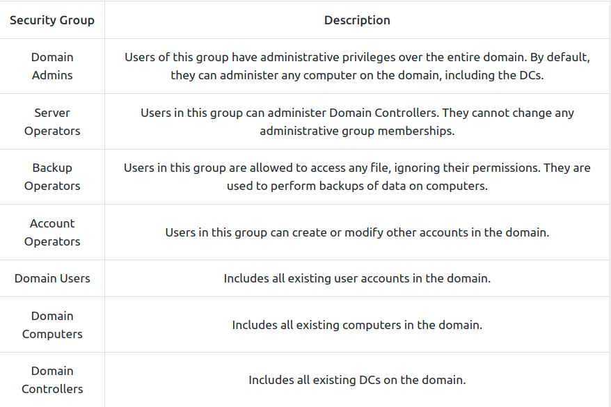
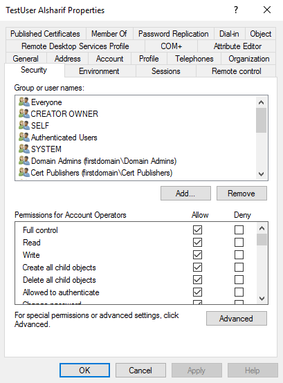

# ActiveDir - WinServers 

> credits
* https://tryhackme.com/module/hacking-active-directory


## 1. AD Theory 

imagen a lot of devices (PCs, Printers, Storage Devices, ...) connected under a single domain called (MainDomain.com),


and there were a single Machine that has an administrator access to all those devices, which responsible for manageing everything on there devices !!!
Ex on this Machine --> Win server 2016,

now all the devices trust this Machine !!
this Machine controles the whole domain.

this machine called the `domain controller` (DC) !!


Now the `Active Directory` is just the service that is running on the DC, that's why it's called `Active Directory Domain Service` (AD DS)


just a service,,, like apache ^^ 

```note
there could multiple DCs .... we call the main one The Primary DC.
```

---------------------------------------------

> The main advantages of having a configured Windows domain are:
```
* Centralised identity management: All users across the network can be configured from Active Directory with minimum effort.

* Managing security policies: You can configure security policies directly from Active Directory and apply them to users and computers across the network as needed.
```


<details><summary>A Real-World Example</summary>
<pre language="haskell"><code> If this sounds a bit confusing, chances are that you have already interacted with a Windows domain at some point in your school, university or work.

In school/university networks, you will often be provided with a username and password that you can use on any of the computers available on campus. Your credentials are valid for all machines because whenever you input them on a machine, it will forward the authentication process back to the Active Directory, where your credentials will be checked. Thanks to Active Directory, your credentials don't need to exist in each machine and are available throughout the network.

Active Directory is also the component that allows your school/university to restrict you from accessing the control panel on your school/university machines. Policies will usually be deployed throughout the network so that you don't have administrative privileges over those computers.
</code></pre>
</details>


---------------------------------------------

## 2. Active Directory objects

AD `objects` are *entities that represent a resource such as users, computers, or printers that are a part of the AD network. Each object is defined by a set of information about them. These pieces of information are called object `attributes`.*

### Users

Users are one of the objects known as `security principals`, meaning that they can be authenticated by the domain and can be assigned `privileges` over resources like files or printers.

```note
You could say that a security principal is an `object` that have a particular effect on resources in the network.
```

> Users can be used to represent two types of entities:
```
* People: users will generally represent persons in your organisation that need to access the network, like employees.

* Services: you can also define users to be used by services like IIS or MSSQL. Every single service requires a user to run, but service users are different from regular users as they will only have the privileges needed to run their specific service.
```


### Machines

for every `computer` that joins the Active Directory domain, a `machine` object will be created. Machines are also considered `security principals`, and are assigned an account just as any regular user

The machine accounts themselves are `local administrators` on the assigned computer, they are generally not supposed to be accessed by anyone except the computer itself, but as with any other account, if you have the password, you can use it to log in.

```note
Machine Account passwords are automatically rotated out and are generally comprised of 120 random characters.
```

> Identifying machine accounts

The machine `account name` is the computer's name followed by a dollar sign. For example, a machine named `DC01` will have a machine account called `DC01$`.


### Security Groups

Security groups are also considered `security principals` and, therefore, can have privileges over resources on the network.

Several groups are created by default in a domain that can be used to grant specific privileges to users

<p align="center"> 
   
  <figcaption align="center">some of the most important groups in a domain</figcaption>
</p> 


<p align="center"> 
   
  <figcaption align="center">some security groups assigned to a user</figcaption>
</p> 


### Organizational Units (OUs) 

Under `Active Directory Users and Computers`

they are container objects that allow you to classify users and machines. OUs are mainly used to define sets of users with similar policing requirements.

```note
Keep in mind that a user can only be a part of a single OU at a time.
```

> Some Default OUs that created by windows :
```
* Builtin: Contains default groups available to any Windows host.

* Computers: Any machine joining the network will be put here by default. You can move them if needed.

* Domain Controllers: Default OU that contains the DCs in your network.

* Users: Default users and groups that apply to a domain-wide context.

* Managed Service Accounts: Holds accounts used by services in your Windows domain.
```


What is the `Tree` vs `Forest` 


---------------------------------------------

## Setup a DC

install windows server 2016 
```
on the server manager --> dashboard --> add roles and featrues --> next x2 --> Select a server from the server pool (notice the addr of the server and it's name {WIN-520O8ACJ9TD}) --> next --> Activate Directory Domain Services Then Add Features --> DNS Server then Add Features --> next x4 --> Restart if required --> install --> close 
```

```
on the dashboard header --> click on the Flag icon --> Promote this server to a domain controller --> Add a new Forest , Root domain name : firstdomain.local (add any name) --> next --> Add a passwd for the DC --> next x2 --> NetBIOS domain name : firstdomain (notice without .local) --> next x3 --> install 
```

the system will be restarted, now we can login using the domainName/Administrator with the DC password

we are logging in as a DC not as Administrator. 

```
now on the server manager --> Tools --> Active Directory Users and Computers --> View --> Advanced Features -->list the components (Organization Units) under the DomainName 

	* you should know that everything in the AD is in a form of objects, each user or computer, ...,etc, is an object 

	and each object consist of bunch of attributes


	* right click on the DomainName --> New --> Organizationl Unit --> Give it a name (TestNetwork)

		* right click on this Organizationl Unit --> New --> Organizationl Unit --> Give it a name (Users)

		* and so on, as much as you want.

		* right click on Users OU --> New --> User 

			* Give it a name and a login name on a specific domain,
			Uncheck {User must change passwd ...} , and give it a password --> next --> finish 
```

### Distinguish names 
a way to discribe the location of object in the tree 

for examble the last user we created distinguished as  :
`CN=TestUser Alsharif,OU=Users,OU=TestNetwork,DC=firstdomain,DC=local`

CN : Common name
OU : Organaizational Unit
DC : Domain Component
```
you can find this Distinguish name by clicking on the user object --> Attrubute Editor --> DistinguishedName
```

```note 
??????????? each computer object have a passwd that is randomly generated by the AD every 30 days, so don't think of cracking them ^^ ???????????   
```


### From a Win-10 Machine 

let's add it to the domain 

first configure the DNS server to be the ip addr of the win server machine (DC)

then change the workgroup to domain 
```
Start Menu --> Chnage workgroup name controle panel

OR

PS> SystemPropertiesAdvanced

Under 'Computer Name' Tab --> change --> Computer name : NEW NAME --> Member of Domain : firstdomain.local --> OK --> Add the name of the administrator/it's password --> OK --> restart
```

now we can login with the User we created above

Username : firstdomain.local\UserName
Password : it's passwd


### krbtgt User ?? 


### Group Policy , Active directory permissions ?? 


## 2. AD Enumeration 

## 3. AD Authentication 

## 4. AD Lateral Movement 

## 5. AD Persistence 