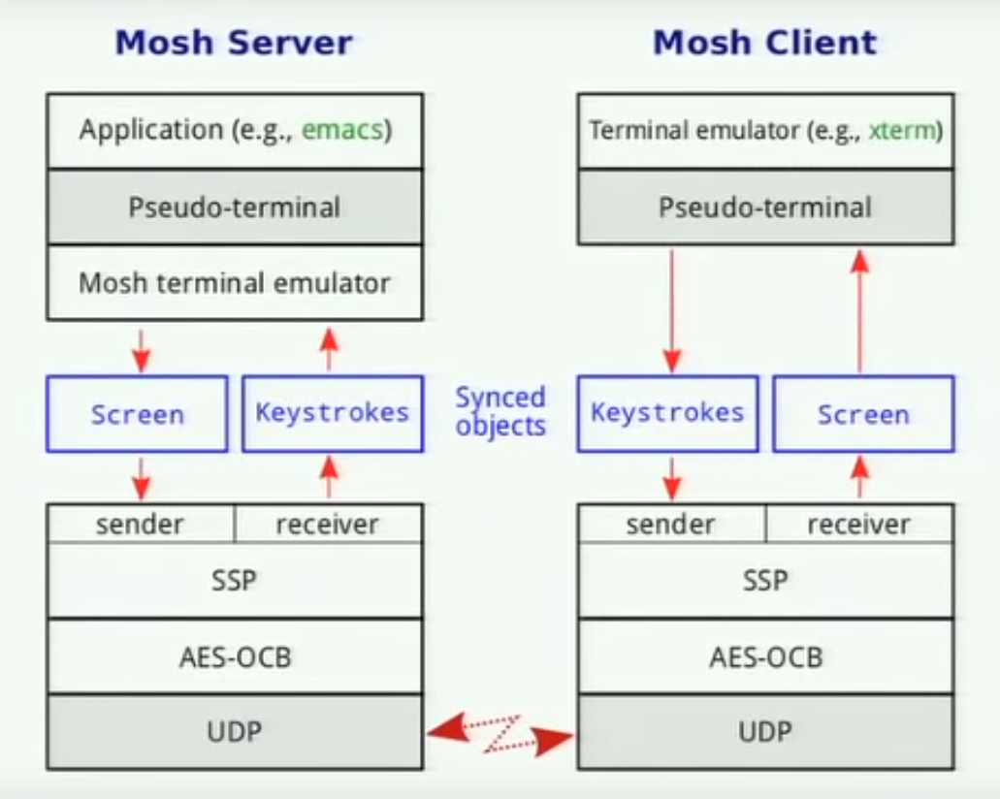

## Mosh better than SSH 

`Remote-shell protocols` traditionally work by conveying a byte-stream from the server to the client, to be interpreted by the client's terminal. (This includes *TELNET*, *RLOGIN*, and *SSH*.).

Uses a new protocol called the `State Synchronization Protocol` (SSP), runs over `UDP`, synchronizing the state of any object from one host to another.

Datagrams are encrypted and authenticated using *AES-128* in *OCB3* mode.

Roaming with SSP becomes easy, while the user keep sending to the server, there will be a _*"heartbeat"*_ datagram sent once every three seconds, by doing roaming *"statelessly"* in this manner, roaming works _in and out of NATs_, Roaming works even when the client's Internet-visible IP address has changed.

Also, Mosh can regulate the frames so as not to fill up network buffers.

<p align="center"> 
   
  <figcaption align="center">credits to https://youtu.be/XsIxNYl0oyU</figcaption>
</p> 


```tip
More details can be found in the mosh(1), mosh-client(1), and mosh-server(1) manual pages.

to install : https://mosh.org/#techinfo
```


```bash
# On the server side
$ mosh-server
# when done 
$ pkill -SIGUSR1 mosh-server


# On the client side 
$ mosh Username@Hostname 
Username@Hostname password: ********* 
```


## References

* https://www.wireguard.com	
* https://mosh.org/