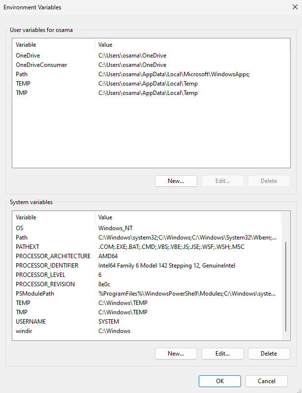
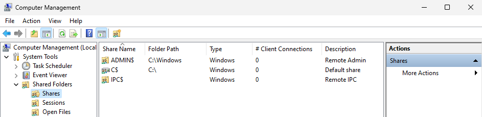

# Windows Fundamentals

## Windows File System

The file system used in modern versions of Windows is the New Technology File System or simply `NTFS`. 

Before `NTFS`, there was `FAT16/FAT32` (File Allocation Table) and `HPFS` (High Performance File System).

You still see FAT partitions in use today. For example, you typically see FAT partitions in `USB devices`, `MicroSD cards`, etc. but traditionally not on personal Windows computers/laptops or Windows servers.

`NTFS` is known as a journaling file system. In case of a failure, the file system can `automatically repair` the folders/files on disk using information stored in a `log file`. This function is not possible with FAT.  

NTFS addresses many of the limitations of the previous file systems; such as: 

    * Supports files larger than 4GB
    * Set specific permissions on folders and files
    * Folder and file compression
    * Encryption (Encryption File System or `EFS`)

If you're running Windows, what is the file system your Windows installation is using? typically the C drive (`C:\`).


### permissions for a file & folder?

On `NTFS volumes`, you can set `permissions` that grant or deny access to files and folders.

The permissions are:

* Full control
* Modify
* Read & Execute
* List folder contents
* Read
* Write


To view the permissions for a file or folder.
```
right-click on the file --> Properties --> Security --> in Group or user names select the gourp to view it's permissions
```

```powershell
function Get-Permissions ($folder) {
  (get-acl $folder).access | select `
		@{Label="Identity";Expression={$_.IdentityReference}}, `
		@{Label="Right";Expression={$_.FileSystemRights}}, `
		@{Label="Access";Expression={$_.AccessControlType}}, `
		@{Label="Inherited";Expression={$_.IsInherited}}, `
		@{Label="Inheritance Flags";Expression={$_.InheritanceFlags}}, `
		@{Label="Propagation Flags";Expression={$_.PropagationFlags}} | ft -auto
		}

> Get-Permissions 'C:\Users\folder'
```


### Files Attributes 

File attributes are `metadata` values stored by the file system on disk and are used by the system and are available to developers via various file I/O APIs.


## User/System Environment Variable

Every process has an environment block that contains a set of environment variables and their values. There are two types of environment variables: `user environment variables` (set for each user) and `system environment variables` (set for everyone).


```
Start Menu --> Edit the system environment variables --> Environment Variables
```

<p align="center"> 
   
</p>    

> cmd
```powershell
# show all env vars
CMD> set

# echo their content
CMD> set %PATH%
CMD> echo %PATH%

# set an Env Var
CMD> set varname=value			# note no spaces around '='
CMD> set PATH=c:\myBin;%PATH%
```

> powershell 
```powershell
# show all env vars
PS> Get-ChildItem env:*

# echo their content
PS> Get-ChildItem env:PATH
```

### Common Windows Env. Var. 

```
%WINDIR%
%PATH%
%TEMP%
```


## C:\Windows\System32

`C:\Windows` is the folder which contains the Windows operating system.

```note
 The folder doesn't have to reside in the C drive necessarily. It can reside in any other drive and technically can reside in a different folder.
```

The `C:\Windows\System32` folder holds the important files that are critical for the operating system. 


### NTFS Alternate Data Stream

Alternate Data Streams (ADS) are a file attribute only found on the NTFS file system.

In this system a file is built up from a couple of attributes, one of them is `$DATA`, aka the data attribute.

Looking at the regular data stream of a text file there is no mystery. It simply contains the text inside the text file. But that is only the primary data stream.

https://www.malwarebytes.com/blog/news/2015/07/introduction-to-alternate-data-streams


Natively Window Explorer doesn't display ADS to the user. There are 3rd party executables that can be used to view this data, but Powershell gives you the ability to `view ADS for files`.

```note
From a security perspective, malware writers have used ADS to hide data.

Not all its uses are malicious. For example, when you download a file from the Internet, there are identifiers written to ADS to identify that the file was downloaded from the Internet.
```


## User Account Control (UAC)

`UserAccountControlSettings.exe`

When a user with an account type of administrator logs into a system, the current session doesn't run with elevated permissions. When an operation requiring higher-level privileges needs to execute, the user will be prompted to confirm if they permit the operation to run. 

```note 
UAC (by default) doesn't apply for the built-in local administrator account. 
```

so try double-click the program with shild icon on it (indicate that UAC will prompt to allow higher-level privilege access), Notice that the built-in administrator account is already set as the user name and prompts the account's password.

After some time, if a password is not entered, the UAC prompt disappears, and the program does not install.


## Tools

Task Manager (`taskmgr.exe`)
Control Panel (`control.exe`)
System config (`msconfig.exe`)
Registry Editor (`regedt32.exe`)
Command Prompt (`cmd.exe`)
Resource Monitor (`resmon.exe`)
Performance Monitor (`perfmon.exe`)
System Information (`msinfo32.exe`)

Computer Management (`compmgmt.msc`)
Local Users and Groups (`lusrmgr.msc`)

```note
where can I find these tools ?  
C:\Windows\System32\	(`64-bit` version)	-->      %windir%\system32\
C:\Windows\SysWOW64\	(`32-bit` version) 	-->      %windir%\syswow64\
```


```note
C:\ProgramData\Microsoft\Windows\Start Menu\Programs\Administrative Tools
```


## System Configuration

`Msconfig.exe`

to troubleshoot configuration errors, with a main purpose to help diagnose startup issues. 

```note
The System Configuration utility is NOT a startup management program. 
refer to the Task manager to (enable/disable) startup items.
```

in the `tool` tab you can also see a list of various utilities and tools. 

you can refer to the `Selected command` section to see the name of the tools, and `Launch` them. 


### Resource Monitor

`resmon.exe`

Resource Monitor displays per-process and aggregate `CPU`, `memory`, `disk`, and `network` usage information, in addition to providing details about which processes are using individual file `handles` and `modules`. Advanced filtering allows users to isolate the data related to one or more processes (either applications or services), `start`, `stop`, `pause`, and `resume` services, and close unresponsive applications from the user interface. It also includes a process analysis feature that can help identify `deadlocked` processes and file locking conflicts so that the user can attempt to resolve the conflict instead of closing an application and potentially losing data.


### Registry Editor 

`regedit.exe`

a central hierarchical database used to store information necessary to configure the system for one or more users, applications, and hardware devices.

The registry contains information that Windows continually references during operation, such as:
```
* Profiles for each user
* Applications installed on the computer and the types of documents that each can create
* Property sheet settings for folders and application icons
* What hardware exists on the system
* The ports that are being used.
```

[For More](https://learn.microsoft.com/en-us/troubleshoot/windows-server/performance/windows-registry-advanced-users)


## Network Configuration


## Computer Management

`compmgmt.msc`

you will see the following secitons.
> System Tools

### Task Scheduler

`taskschd.msc`

with Task Scheduler, we can create and manage common tasks that our computer will carry out automatically at the times we specify.

A task can run an application, a script, etc. and tasks can be configured to run at any point. A task can run at log in or at log off. Tasks can also be configured to run on a specific schedule, for example, every five mins.

tasks are stored in folders in `Task Scheduler Library`.


### Event Viewr & Event Logs 

`eventvwr.msc` 

### Shared Folders

<p align="center"> 
   
</p>    

As with any object in Windows, you can right-click on a folder to view its properties, such as `Permissions` (who can access the shared resource).

Under `Sessions`, you will see a list of users who are currently connected to the shares.

All the folders and/or files that the connected users access will list under Open Files.


### Local User and Group

`lusrmgr.msc`

User accounts can be one of two types on a typical local Windows system: `Administrator` & `Standard User`.


When a user account is created, a profile is created for the user. The location for each user profile folder will fall under is `C:\Users`.

Each user profile will have the same folders; a few of them are:
```
* Desktop
* Documents
* Downloads
* Music
* Pictures
```

```
* Under the Users Folder --> Select a username --> Under 'Member Of' tab you can see the groups the user assigned to
```

Each group has permissions set to it, and users are assigned/added to groups by the Administrator. When a user is assigned to a group, the user inherits the permissions of that group. A user can be assigned to multiple groups.


### Performance & Device Manager

`perfmon.exe`

Perfmon is used to view performance data either in real-time or from a log file. This utility is useful for `troubleshooting` performance issues on a computer system, whether local or remote.
  
`Device Manager` allows us to view and configure the `hardware`, such as disabling any hardware attached to the computer.


> Storage

### Disk Management

<p align="center"> 
   
</p> 

Disk Management is a system utility in Windows that enables you to perform advanced storage tasks.  Some tasks are:
```
* Set up a new drive
* Extend a partition
* Shrink a partition
* Assign or change a drive letter (ex. E:) 
```


> Services and Applications

### Services 

Here we can enable and disable a service, and view the Properties of it. 

```note
a service is a special type of application that runs in the background. 
```

### WMI Control 

Configures and controls the Windows Management Instrumentation (`WMI`) service.

Per Wikipedia, WMI *allows scripting languages* (such as VBScript or Windows PowerShell) *to manage Microsoft Windows personal computers and servers*, both locally and remotely. Microsoft also provides a command-line interface to WMI called Windows Management Instrumentation Command-line (`WMIC`).

```note
Note: The WMIC tool is `deprecated` in Windows 10, version 21H1. Windows PowerShell supersedes this tool for WMI.
```


# System Information

`msinfo32.exe`

This tool gathers information about your computer and displays a comprehensive view of your hardware, system components, and software environment, which you can use to diagnose computer issues.


The information in System Summary is divided into three sections:
```
* Hardware Resources
* Components
* Software Environment
```


```warning
Attackers use built-in Windows tools and utilities in an attempt to go undetected within the victim environment.  This tactic is known as Living Off The Land. Refer to the following resource (https://lolbas-project.github.io/) to learn more about this. 
```


## Firewall

`WF.msc`

Traffic flows into and out of devices via what we call ports. A firewall is what controls what is - and more importantly isn't - allowed to pass through those ports. You can think of it like a security guard standing at the door, checking the ID of everything that tries to enter or exit

```
Start Menu --> Firewall & network protection
```

<p align="center"> 
   
</p> 


Windows Firewall offers three firewall profiles: `domain`, `private` and `public`.
```
* Domain - The domain profile applies to networks where the host system can authenticate to a domain controller. 

* Private - The private profile is a user-assigned profile and is used to designate private or home networks.

* Public - The default profile is the public profile, used to designate public networks such as Wi-Fi hotspots at coffee shops, airports, and other locations.
```

See Also

```
* Allow an app through firewall
* Advanced setting
```


## Microsoft Defender SmartScreen

Microsoft Defender SmartScreen protects against phishing or malware websites and applications, and the downloading of potentially malicious files

```
Start Menu --> App & browser control --> Reputatoin-based protection
```


```
Start Menu --> App & browser control --> Exploit Protection

	* CFG
	* DEP
	* ASLR
	* validate heap integrity
	* ...
```


## Device Security

* Core Isolation
	* `Memory Integrity` --> Prevents attacks from inserting malicious code into high-security proccesses. (Off by Def)


* Data Encryption
	* `BitLocker drive encryption` --> is a data protection feature that integrates with the operating system and addresses the threats of data theft or exposure from lost, stolen, or inappropriately decommissioned computers


## Volume Shadow Copy Service (VSS)

creating a consistent `snapshot` or a point-in-time copy) of the data that is to be `backed up`

Volume Shadow Copies are stored on the System Volume Information folder on each drive that has protection enabled.


## Remote Desktop Protocol (RDP)

The Microsoft Remote Desktop Protocol (RDP) provides remote display and input capabilities over network connections for Windows-based applications running on a server.” (`MSDN`)

Essentially, RDP allows users to control their remote Windows machine as if they were working on it locally (well, almost).


Communication in RDP is based on multiple channels, and the protocol theoretically supports up to `64,000` unique channels.

The basic functionality of RDP is to transmit a monitor (output device) from the remote server to the client and the keyboard and/or mouse (input devices) from the client to the remote server. The communication during an RDP connection will be extremely `asymmetric`, while most of the data will go from the server to the client. RDP communication is encrypted with `RSA’s RC4` block cipher by default.


[For more about RDP](https://www.cyberark.com/resources/threat-research-blog/explain-like-i-m-5-remote-desktop-protocol-rdp) 


```note
Typically over TCP port `3389`
```


### Enable Remote Desktop on Windows

Search for : Remote Desktop Settings --> Enable Remote Desktop


### Tools

* remmina

```
* Click on the new file icon on the top left side
	* Server : 192.168.1.x
	* Username : user
	* Password : ***********

	* Color Depth : RemoteFX(32 bpp) 

* connect
```

* rdesktop


## References & Images

* https://tryhackme.com/room/windowsfundamentals1xbx

* https://www.cyberark.com/resources/threat-research-blog/explain-like-i-m-5-remote-desktop-protocol-rdp

* https://learn.microsoft.com/en-us/previous-versions/windows/it-pro/windows-2000-server/bb727008(v=technet.10)?redirectedfrom=MSDN