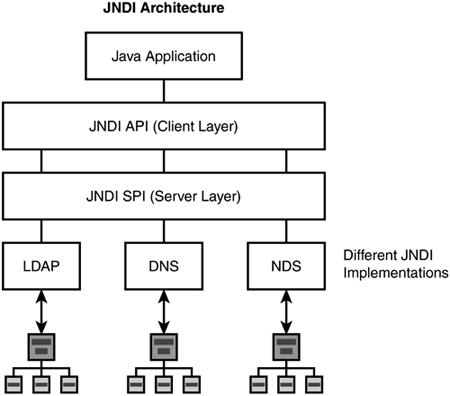

# JNDI injection & LDAP Entry Poisoning 

## Introduction
> JNDI is a NutShell

`Java Naming and Directory Interface`, is a common interface to interact with Naming and Directory Services/Providers.


### # What is Naming Service/Provider 
is a system that `Binds` a name to a given value/object.

It provides a facility to find an object based on a name that is known as `Lookup` or `Search` operation.

```note
EX : DNS Naming Service, that Binds the IP adddress to the host name 

EX : File System Naming Service, that binds the file name to the file itself   
```

### # What is Directory Service/Provider
is a service that allows `Storing` and `finding` special type of objects that is known as Directory Object -- A collection of attributes --

thereore it offers extended functionality to operate on the object attributes. 

```note
EX : LDAP Directory Service, that stores things like employee records with all the collection of attributes (name, email, location, ...)  
```

---------------------------------------------------
## JNDI Architecture    
JNDI offers a common interface to interact with different types of Services/Protocols .

<br>
<p align="center">
   
</p>
<br>


As we see the API exposes the methods to Bind, to Lookup or search for names, to rename a binding or delete a binding and so on. 

And the Server Provider Interface (SPI) allows different services to be managed by JNDI. 

---------------------------------------------------
## JNDI In Action 

```note
RMI Registry is a Naming Service, that binds a name to a given java object 
```

```java 
// The initial context configured to work with RMI Regestry (Choosen Provider Here)
Hashtable env = new Hashtable();
env.put(INITIAL_CONTEXT_FACTORY, "com.sun.jndi.rmi.registry.RegistryContextFactory");
env.put(PROVIDER_URL, "rmi://localhost:1099");  // the Registry Running on localhost

// Initialize the context
Context ctx = new InitialContext(env);

// Bind string to name foo in the RMI Registry 
ctx.bind("foo", "Sample String");

// Look up the object 
Object local_obj = ctx.lookup("foo"); 
// Recover the objects using lookup operation, on the same JVM or diff JVM ???  
```
Other Services can be used by using different `PROVIDER_URL`
```java 
env.put(INITIAL_CONTEXT_FACTORY, "com.sun.jndi.ldap.LdabCtxFactory");
env.put(PROVIDER_URL, "ldab://localhost:389");
```


```note
JVM - Java Virtual Machine 
```

<br>
<br>


If we want to bind java object to a Naming/Directory Service We can use the data serialization of the object - binding the binary representation to the given name
---

>But if the object is too large or not serializable we can use some thing called Naming References 


