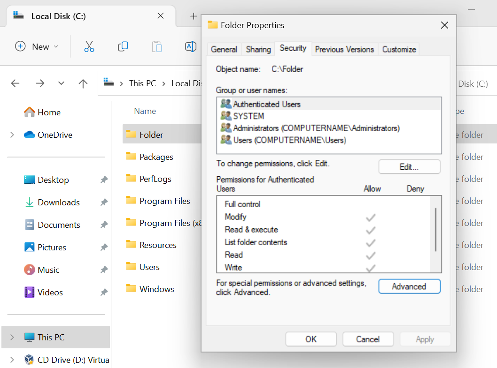

# Intro

Big thanks to [HTB Academy](https://academy.hackthebox.com/)

## History

Microsoft first introduced the Windows OS on `1985`.

Windows 95 was the first full integration of Windows and DOS and offered built-in Internet support for the first time.

Windows Server was first released in `1993` with the release of Windows NT 3.1 Advanced Server.

With the release of Windows 2000, Microsoft debuted Active Directory + Microsoft Management Console (MMC).

> Versions 

- Windows NT 4
- Windows 2000
- Windows XP
- Windows Server 2003, 2003 R2
- Windows Vista, Server 2008
- Windows 7, Server 2008 R2
- Windows 8, Server 2012
- Windows 8.1, Server 2012 R2
- Windows 10, Server 2016, Server 2019


`Windows NT` is a family of Windows operating systems from 1993 that includes Windows 2000, Vista, 7, 8, 8.1, Windows 10, and now Windows 11

```note
NT = New Technology
```


## Remote Access 

> SSH 

> VPN 

> FTP 

> VNC

> WinRM

> RDP 

- By default, remote access is **not** allowed on Windows operating systems.
- Remote Desktop Files (.rdp)
- RDP Clients :
    
    ```powershell
    PS> mstsc.exe
    ``` 

    ```bash
    $ Xfreerdp /v:$IP /u:$USERNAME /p:$PASSWD
    ```

    ```bash
    $ rdesktop -u $USERNAME $IP
    ```
    
    ```bash
    $ remmina
    ```

<br>
<br>

## Windows Directory Structure

the root directory (boot partition) is `<drive_letter>`:\ (commonly `C` drive)

| Directory | Function |
|-----------------------------------|------------------------|
| Perflogs |  Windows performance logs (empty by default) |
| Program Files | All **16-bit** and **32-bit** programs on `32-bit` systems. <br> Only **64-bit** programs on `64-bit` systems |
| Program Files (x86) | **32-bit** and **16-bit** programs on `64-bit` systems. |
| ProgramData | A _hidden folder_ contains essential data for certain installed programs to run. <br> This data is accessible by the program no matter what user is running it. |
| Users | Contains user profiles for each user that logs onto the system <br> And contains the two folders Public and Default. |
| Default | This is the default user profile template for all created users. |
| Public | This folder is intended for computer users to **share files** and is accessible to all users by default. This folder is shared over the network by default but requires a valid **network account** to access. |
| AppData | Per user application data and settings are stored in a hidden user subfolder (i.e., user.name\AppData). <br> Each of these folders contains three subfolders. <br> - The `Roaming folder` contains machine-independent data that should follow the user's profile, such as custom dictionaries. <br> - The `Local folder` is specific to the computer itself and is never synchronized across the network. <br> - The `LocalLow` is similar to the Local folder, but it has a lower data integrity level. Therefore it can be used, for example,  by a web browser set to protected or safe mode.  |
| Windows | Windows operating system required files. |
| System, System32, SysWOW64 | They Contains all **DLLs** required for the core features of Windows and the Windows API. <br> The operating system searches these folders any time a program asks to load a DLL without specifying an absolute path. |
| WinSxS | The **Windows Component Store** contains a copy of all Windows components, updates, and service packs. |

## Windows File System

There is 5 types : 
* `FAT12` & `FAT16` (both deprecated), `FAT32`, `NTFS`, and `exFAT`.

**FAT** = File Allocation Table
- Used in : SD Cards  / USBs / and to format hard drives.
- 32 == identifying the data cluster on the storage account. 

*FAT32 Cons* 
- Can only be used with files that are less than 4GB.
- No built-in data protection or file compression features.
- Must use third-party tools for file encryption

**NTFS** = New Technology File System 
- The default win file sys type **currently**

## Permissions

### Basic

|     Permission Type    |     Description    |
|---|---|
|Full Control| Allows reading, writing, **changing**, deleting of files/folders.|
|Modify| Allows reading, writing, and deleting of files/folders.|
|List Folder Contents| Allows for **viewing** and **listing** folders and subfolders as well as **executing** files. <br> *Folders only inherit this permission.*|
|Read and Execute| Allows for viewing and listing files and subfolders as well as executing files. <br> *Files and folders inherit this permission*.|
| Write| Allows for **adding** files to folders and subfolders and **writing** to a file.|
| Read | Allows for **viewing** and **listing** of folders and subfolders and **viewing** a file's contents.|


### Advanced

|     Permission    |     Description    |
|---|---|
|     Full control    |     Users are   permitted or denied permissions to add, edit, move, delete files &   folders as well as change NTFS permissions that apply to all permitted   folders    |
|     Traverse folder / execute file    |     Users are   permitted or denied permissions to access a subfolder within a directory   structure even if the user is denied access to contents at the parent folder   level. Users may also be permitted or denied permissions to execute programs    |
|     List folder/read data    |     Users are   permitted or denied permissions to view files and folders contained in the   parent folder. Users can also be permitted to open and view files    |
|     Read attributes    |     Users are   permitted or denied permissions to view basic attributes of a file or folder.   Examples of basic attributes: system, archive, read-only, and hidden    |
|     Read extended attributes    |     Users are   permitted or denied permissions to view extended attributes of a file or   folder. Attributes differ depending on the program    |
|     Create files/write data    |     Users are   permitted or denied permissions to create files within a folder and make   changes to a file    |
|     Create folders/append data    |     Users are   permitted or denied permissions to create subfolders within a folder. Data   can be added to files but pre-existing content cannot be overwritten    |
|     Write attributes    |     Users are   permitted or denied to change file attributes. This permission does not grant   access to creating files or folders    |
|     Write extended attributes    |     Users are   permitted or denied permissions to change extended attributes on a file or   folder. Attributes differ depending on the program    |
|     Delete subfolders and files    |     Users are   permitted or denied permissions to delete subfolders and files. Parent   folders will not be deleted    |
|     Delete    |     Users are   permitted or denied permissions to delete parent folders, subfolders and   files.    |
|     Read permissions    |     Users are   permitted or denied permissions to read permissions of a folder    |
|     Change permissions    |     Users are   permitted or denied permissions to change permissions of a file or folder    |
|     Take ownership    |     Users are   permitted or denied permission to take ownership of a file or folder. The   owner of a file has full permissions to change any permissions    |


### Managing Permissions

```powershell
PS> Exploere.exe 
# > Security > Advanced > ...  
```

```note
Files and folders inherit the NTFS permissions of their parent folder for ease of administration.

By default, all NTFS permissions are inherited from the parent directory. 
In the Windows world, the C:\ drive is the parent directory to rule all directories, unless a system administrator were to **disable inheritance** inside a newly created folder’s advanced Security settings.

File/Folder Right Click > Properties > Security > Advanced > Disable inheiritance
```

```note 
Anytime we see a gray checkmark next to a permission, it was inherited from a parent directory.
```

<p align="left" style="width:50%"> 
   
</p>


### Integrity Control Access Control List (icacls)

```powershell
PS> icacls.exe 
PS > icacls.exe .\Folder\
# .\Folder\ BUILTIN\Administrators:(I)(OI)(CI)(F)
#           NT AUTHORITY\SYSTEM:(I)(OI)(CI)(F)
#           BUILTIN\Users:(I)(OI)(CI)(RX)
#           NT AUTHORITY\Authenticated Users:(I)(M)
#           NT AUTHORITY\Authenticated Users:(I)(OI)(CI)(IO)(M)

# Successfully processed 1 files; Failed processing 0 files
```

The possible inheritance settings are:
- `(CI)`: container inherit
- `(OI)`: object inherit
- `(IO)`: inherit only
- `(NP)`: do not propagate inherit
- `(I):` permission inherited from parent container

Basic access permissions are as follows:
- `F` : full access
- `D` : delete access
- `N` : no access
- `M` : modify access
- `RX`: read and execute access
- `R` : read-only access
- `W` : write-only access


```powershell
# Grant permission of a File/Folder to a User 
PS> icacls.exe C:\Folder\ /grant USER:F 
# The User Won't have a permission to the sub-directories since the (oi) and (ci) not included in the command 

PS> icacls.exe C:\Folder\
# C:\Folder\ COMPUTERNAME\osama:(F)   <==================== give access to the user osama
#         BUILTIN\Administrators:(I)(OI)(CI)(F)
#         NT AUTHORITY\SYSTEM:(I)(OI)(CI)(F)
#         BUILTIN\Users:(I)(OI)(CI)(RX)
#         NT AUTHORITY\Authenticated Users:(I)(M)
#         NT AUTHORITY\Authenticated Users:(I)(OI)(CI)(IO)(M)
```

```powershell
# Remove permission of a File/Folder to a User 
PS> icacls.exe C:\Folder\ /remove USER 
```

[For more](https://ss64.com/nt/icacls.html)

>>>> Audit

## Server Message Block (SMB) 

The `SMB` protocol: is used in Windows to connect shared resources like files and printers.

Many variants of malware written for Windows can spread over the network via network shares with lenient permissions applied.

### NTFS vs. Share Permissions

NTFS permissions and share permissions are not the same ---->  but often apply to the same shared resource.
Which means both the SMB and NTFS permissions lists apply to every resource that gets shared in Windows. 
NOTE : : Security settings override Share permissions.

NTFS permissions apply to the system where the folder and files are hosted 
The share permissions apply when the folder is being accessed through SMB, typically from a different system over the network. 
This means someone logged in locally to the machine or via RDP can access the shared folder and files by simply navigating to the location on the file system and only need to consider NTFS permissions

#### Share Permissions

|     Permission    |     Description    |
|---|---|
|     Full Control    |     Users are   permitted to perform all actions given by Change and Read permissions as well   as change permissions for NTFS files and subfolders    |
|     Change    |     Users are   permitted to read, edit, delete and add files and subfolders    |
|     Read    |     Users are   allowed to view file & subfolder contents    |


<br>

Keep in mind that in most large enterprise environments, shares are created on a Storage Area Network (`SAN`), Network Attached Storage device (`NAS`), or a `separate partition` on drives accessed via a server operating system like Windows Server.

Similar to NTFS permissions, there is an access control list (ACL) for shared resources. We can consider this the SMB permissions list
The `ACL` contains access control entries (`ACEs`). -----> are made up of users & groups (also called `security principals`)

Notice the default access control entry and default permissions settings.

<p align="left" style="width:50%"> 
   
</p>


### Creating Shared Folder

#### On Windows Machine

1. Search > Manage advanced sharing settings > Enable File and printer sharing

2. Search > Windows Defender Firewall > Advanced settings > Inbound rules 

   - Enable "File and Printer Sharing (NB-Session-In)"
   - Enable "File and Printer Sharing (SMB-In)"

```note
Firewall rules on desktop systems can be centrally managed when joined to a Windows Domain environment through the use of `Group Policy`. 
```

3. Create a Folder > Right Click > Properties > Sharing > Advanced Sharing > Enable "Share this folder" > Permissions > Select the needed permissions & Assing the related Groups. 

4. To list the exsisting shared folders on your system 

   - File Explorer > Search > \\\\IP

   - or from the Search > Computer Management > Under System Tools _ Shares _ … 

   - or using powershell
        ```powershell
        PS> net share
        # Share name   Resource                        Remark
        # ------------------------------------------------------------------------
        # IPC$                                         Remote IPC
        # C$           C:\                             Default share
        # ADMIN$       C:\Windows                      Remote Admin
        # Folder       C:\Folder
        ``` 


5. to access the shared folder

   - make sure the folder assigned the right ACEs

   - File Explorer > Search > \\\\IP\ShareName

   - using powershell
        ```powershell
        PS> net use \\IP[\ShareName] /USER:\USERNAME PASSWORD
        PS> cd "\\IP\ShareName\"
        ```

<br>
<br>

#### On Linux Machine


1. create temp smb-server
    ```bash
    $ impacket-smbserver ShareName FolderToShare -smb2support
    ```

2. To list the exsisting shared folders on your system 

   - using smbclient
        ```bash
        $ smbclient -L \\\\IP -U USERNAME --password=PASSWORD
        ```

3. to access the shared folder

   - make sure the folder assigned the right ACEs

   - using smbclient
        ```bash
        $ smbclient \\\\IP\\ShaerName -U USERNAME --password=PASSWORD

        # Creating mount point to the shared folder
        $ sudo apt-get install cifs-utils
        $ sudo mount -t cifs -o username=USERNAME,password=PASSWORD //IP/ShareName /home/USERNAME/..../MonutDest
        ```


<br>
<br>
<br>


## Windows Services

Windows services are managed via the `Service Control Manager (SCM)` system, accessible via the `services.msc`  `Microsoft Management Console (MMC)` add-in.

`Microsoft Saved Console Files (msc)`

It is also possible to query and manage services via the command line using `sc.exe` using PowerShell cmdlets such as `Get-Service`.

Service statuses can appear as **Running**, **Stopped**, or **Paused**, and they can be set to start **manually**, **automatically**, or on a **delay at system boot**.

Windows has three categories of services: 
- Local Services
- Network Services
- System Services.
 
```note
**Misconfigurations** around service permissions are a common privilege escalation vector on Windows systems.
```

In Windows, we have some critical system services that cannot be stopped and restarted without a *system restart*. If we update any file or resource in use by one of these services, we must restart the system.

| Service | Description |
|---|---|
| smss.exe | Session Manager SubSystem. Responsible for handling sessions on the system. |
| csrss.exe | Client Server Runtime Process. The user-mode portion of the Windows subsystem. |
| wininit.exe | Starts the Wininit file .ini file that lists all of the changes to be made to Windows when  the computer is restarted after installing a program. |
| logonui.exe | Used for facilitating user login into a PC |
| lsass.exe | The Local Security Authentication Server verifies the validity of  user logons to a PC or server.  It generates the process responsible for  authenticating users for the Winlogon service. |
| services.exe | Manages the operation of starting and stopping services. |
| winlogon.exe | Responsible for handling the secure attention sequence, loading a  user profile on logon,  and locking the computer when a screensaver is  running. |
| System | A background system process that runs the Windows kernel. |
| svchost.exe with RPCSS | **Manages system services that run from dynamic-link libraries** (files  with the extension .dll) such as  "Automatic Updates," "Windows  Firewall," and "Plug and Play." Uses the Remote Procedure Call (RPC)  Service (RPCSS). |
| svchost.exe with Dcom/PnP |	Manages system services that run from dynamic-link libraries (files with the extension .dll) such as "Automatic Updates," "Windows Firewall," and "Plug and Play." Uses the Distributed Component Object Model (DCOM) and Plug and Play (PnP) services.|


[For more](https://en.wikipedia.org/wiki/List_of_Microsoft_Windows_components#Services)


## Windows Processes

Processes **run in the background** on Windows systems. They either *run automatically* as part of the Windows operating system or are *started by other installed applications.*